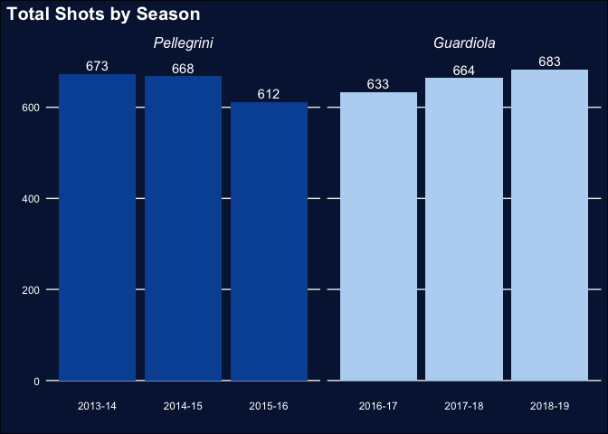

# I. Introduction

  Pep Guardiola is considered to be one of the greatest tactical masterminds in modern football. He is a coach who possesses all the skills and experience to transform any team into a dominant champion in any worldwide competition. As a manager, Guardiola holds the record for the most consecutive league games won in La Liga (Spain), the Bundesliga (Germany), and the English Premier League. Guardiola has managed to win a total of 30 trophies in his career as manager of Barcelona, Bayern Munich, and his current club, Manchester City. How did Guardiola change the style of play and influence the performance of English football club Manchester City after his appointment as manager in July 2016?  

  The purpose of this study is to perform a comparative analysis of the style of play and performance of the football club Manchester City before and after the appointment of Pep Guardiola. We will evaluate data from the 2013-14 season through the 2018-19 season. During the first three seasons covered in our analysis (2013-14, 2014-15, 2015-16), Manuel Pellegrini was manager of Manchester City, leading them to one Premier League title in the 2013-14 season. Following the removal of Pelligrini in June 2016, Pep Guardiola was appointed manager and was expected to completely change Manchester City's style of play with his world famous Tika-Taka style.

  In order to answer our primary research question, we will explore the following secondary research questions:
  
· How did Manchester City perform during Pellegrini's tenure as manager compared to during Guardiola's tenure?

· How did Manchester City perform offensively over the seasons?

· How did Manchester City perform defensively over the seasons?


  As football players and fans, it is hard not to admire the characteristic style of play of Guardiola's teams and the way he is consistently able to build his teams into the dominant force in their respective leagues. In the documentary "All or Nothing: Manchester City", it is crystal clear that Guardiola has a remarkable obsession with the tactical side of soccer and the style of play of his side. Everything Guardiola does as a manager seems to stem from an almost pathological attention to detail. As any football player will tell you, small details, performed consistently over time, can make the difference needed to crown a team champion at the end of the season. We are motivated to achieve a better understanding of these details through this analysis. 

  This study is divided into six sections. The following section includes a biography of Pep Guardiola, including his time as a professional football player and as a coach. Next, we will then present the style of play Guardiola has implemented at Manchester City and how it has changed over the seasons. We will then introduce our data before analyzing the results of various statistical transformations and visualizations. In the fifth section, we will summarize our findings and provide limitations and future research possibilities as an extension to this study. 


**II. Pep Guardiola**

  Guardiola spent the majority of his playing career as a defensive midfielder for Spanish club Barcelona. Johan Cruyff, one of football's most legendary players, as manager of Barcelona, transformed the club into a celebrated champion, with Guardiola playing a central role, as they won the club's first ever European Cup in 1992 and four La Liga titles from 1991 to 1994. Guardiola also captained Barcelona from 1997 until his departure from the club in 2001. He earned 47 caps (appearances) for the Spanish national team, and was part of the team at the 1994 World Cup and Euro 2000. After his retirement as a player, Guardiola became the coach of Barcelona B. After being appointed as manager of Barcelona's first team in May 2008, Guardiola immediately made his mark by telling key players like Ronaldinho, Deco, and Samuel Eto'o that they were not part of his plans. Guardiola then went on to sign defenders Dani Alves and Gerard Piqué, and promoted youth players Sergio Busquets and Pedro to the first team. All three of these players would go on to be key figures in Barcelona's era of dominance in modern football. In his first season at Barcelona, Guardiola guided his side to the treble: winning La Liga, La Copa del Rey, and the UEFA Champions League. This feat made him the youngest ever manager to accomplish this. When Guardiola left the club in 2012, he had won 14 trophies as manager of Barcelona, a historical club record. 

*[Source: https://www.kicker.de/fc-bayern-muenchen/team-trainer/bundesliga/2013-14]*

*[Source: https://www.nytimes.com/2018/04/06/sports/soccer/manchester-city-united-pep-guardiola.html]*

After a short sabbatical and an intensive German language course, Guardiola was announced as the new manager of Bayern Munich in 2013. During his time at one of the greatest clubs in the history of football, Guardiola won the Bundesliga in three consecutive seasons, including two domestic doubles. 

While Guardiola's Bayern side won a domestic double in his final year in 2016, Manchester City only managed to take fourth place in the English Premier League. The fourth place finish qualified City for a spot in next season's Champions League, an annual club football competition contested by the top clubs in Europe. In February of 2016, Manchester City announced the appointment of Pep Guardiola as manager for their upcoming season. Many blame the subpar performance of Manchester City during the 2015-16 season and the failure of Manuel Pelligrini during his final season in charge on this mid-season announcement of Guardiola's impending arrival. Before Pep's appointment was announced, Manchester City were only three points short of first place in the Premier League. By the end of the season, they had fell 15 points behind champion Leicester City and only barely qualified for the group stage of next season's Champions League. During Pellegrini's tenure at Manchester City from 2013 to 2016, he managed to win one Premier League title and two League Cups. 

*[Source: https://www.manchestereveningnews.co.uk/sport/football/football-news/man-city-pellegrini-guardiola-destabilising-11336011]*

During Guardiola's first year as a Manchester City manager, he signed critical players, such as Oleksandr Zinchenko, Leroy Sané, İlkay Gündoğan, Claudio Bravo, and Gabriel Jesus. Guardiola is known for transforming the playing style of any new team he manages. Doing so requires making signings that fit into his desired style of play and plan for the team. During a disappointing 2016-17 season at Manchester City, Guardiola did not manage to win any trophies. However, his first season in charge allowed him to identify the changes necessary to improve the team in the battle for the Premier League title in the upcoming 2017-18 season. He made new acquisitions in the summer transfer window, signing goalkeeper Ederson Moraes, midfielder Bernardo Silva, as well as full-backs Danilo, Benjamin Mendy, and Kyle Walker, while dropping all four senior full backs from his team. The Manchester City squad had the fourth highest average squad age in the entire Premier League during the 2016-17 season, which explains some of Guardiola's challenges during his first season in charge. The signings made in the lead up to the 2017-18 season made Manchester City the 6th youngest squad in the league. 

In the weeks leading up to the final part of the 2017-18 season, Guardiola had managed to put Manchester City in a position to break several Premier League records. On 15 April 2018, Manchester City won the Premier League with the most wins (32) in league history, most away wins (16) in league history, most points (100) in league history, and the most goals (106) in league history. 2017-18 was a historical Premier League season for Manchester City and Guardiola's first title in England. Manchester City also managed to win the EFL Cup with a 3-0 victory over Arsenal. However, City were knocked out of the Champions League after losing both legs of their quarterfinal against Liverpool. 

During Guardiola's third season in charge, he signed attacking midfielder Riyad Mahrez from Leicester City for a fee of £60 million. Manchester City had fully adapted Guardiola's style of play and dominated the Premier League in the previous season. They immediately started their 2018-19 season with a trophy, the 2018 FA Community Shield, with a victory over Chelsea. In the 2018-19 season, Guardiola faced one of his biggest challenges as the manager of Manchester City. In order to win the title, Manchester City had to win 14 games in a row. Guardiola called it one of the toughest challenges in all his career. However, after all 38 games were played, Manchester City was once again on top of the league with 98 points, one point above Liverpool. City finished the 2018-19 season with 32 wins and an impressive 95 goals scored. Besides the FA Community Shield and Premier League title, Manchester City also managed to win the FA Cup and became one of the first ever men's teams in England to win the domestic treble. 


**III. Guardiola's Style of Play**

*General*

The style of play characteristic of teams coached by Pep Guardiola can be summarized by five pillars:

1. A high percentage of possession.

2. A high number of passes completed and a high percentage of passes completed.

3. Pushing the full-backs high into the attack to provide crosses.

4. An ability to keep possession under high pressure and to play the ball out from the back. 

5. Pressing and winning the ball back quickly once they lose possession. 

*Guardiola's Style of Play over The Years*

Below, we will identify key elements of Manchester City's team and how their style of play changed over the different seasons with Guardiola as manager.
  
*2016-2017 Season*

· Pep struggled to find his best XI during the 2016-17 season and experimented with eight different formations in 38 Premier League matches. 

· Most often, Manchester City played in a 4-3-3 formation. In this formation, Kevin de Bruyne and David Silva were assigned the "free 8" roles in the midfield, advancing to the "10" (attacking midfield) positions in possession and drawing back to the "6" (defensive midfield) positions in defense.  

· When Manchester City had possession in their own half, the defensive midfielder, Fernandinho, dropped in between the two center-backs, who spread wide. Kolarov, as a left-footed left center-back was able to distribute the ball to both wingers as he averaged the most long passes per match for Manchester City during the 2016-17 season (4.2 long passes per game on average).

· At Barcelona and Bayern Munich, Pep Guardiola had full-backs who were capable of dominating the entire left and right flank. However, during the 2016-17 season with Manchester City, Guardiola's full-backs were older players who proved to be incapable of fitting into his desired style of play. 

· Guardiola played with a 3-2-5 formation in attack with the two center-backs and the "6" in the back, both full-backs in front of them to secure the midfield, pushing up the "8s" (box-to-box midfield), Kevin de Bruyne and David Silva, into advanced "10" positions in support of the attacking front 3 players. This was done in possession in the opponent's half of the field with the aim of congesting the center of the field in order to prevent counterattacks. 

· One of the main challenges in this season was build-up play. Both full-backs who controlled the midfield in possession were not good enough on the ball, which slowed down the ball progression and therefore hindered City's attack. 

· Despite facing these challenges, there was an overall improvement in the 2016-17 season as Manchester City scored more goals, had a higher average possession percentage, and a higher passing average per game than during the 2015-16 season under Pellegrini. 

· Ultimately, Manchester City lost in the fourth round of the Carabao Cup, the semi-finalls of the FA Cup, and the Round of 16 of the Champions League. On top of all of this, they were only able to secure third place in the Premier League, finishing 15 points behind Premier League champion Chelsea. 

*2017-2018 Season*

· With the signings of full-backs Danilo, Benjamin Mendy, and Kyle Walker, Pep Guardiola changed to a 5-3-2 formation. He was able to change from a 4-3-3 formation to a 5-3-2 formation because his full-backs were able to dominate the entire flank and therefore fit better into Guardiola's desired style of play.

· Due to an early season injury of Mendy (the left full-back), Pep Guardiola changed back to the 4-3-3 formation while transforming central midfielder Fabian Delph into a left full-back. 

· New goalkeeper Ederson Moraes became vital in Guardiola's style of play as he was able to comfortably become part of Manchester City's possession game, building out from the back as well as playing long range passes with extreme precision. This allowed Manchester City to easily break pressure from the opponent in their own half with Ederson playing accurate long range passes over the opponent's lines, allowing the City forwards to make penetrating runs behind. 

· In Manchester City's build-up play, the full-backs played a key role. Left-back Delph would tuck into the midfield, creating a three-player back line with Walker to the right of the center-backs. This allowed Fernandinho to get possession in the midfield instead of dropping in between the two center-backs like he had done during the 2016-17 season. During the 2017-18 season, Fernandinho increased in his average number of passes per game from 68 to 88, and thus was able to dictate City's build-up play. 

· The Delph and Fernandinho combination in midfield increased the speed of City's build-up play compared to the duo of Bacary Sagna & Gael Clichy in the previous season. At the same time, right-back Kyle Walker had a better understanding of his role as a full-back and was able to determine when to stay behind as a center-back and when to push higher up to join the attack and serve crosses. 

· Both Kevin de Bruyne and David Silva kept similar roles to the 2016-17 season, but now had the ability to come into positions to influence the opponent's midfielders and entire defense line with their play. They were able to choose between making penetrating passes to their wingers behind the opponent's back line, combination passes with the striker, crossing from the outside the box, and taking direct shots on goal. 

· The key changes to Manchester City's style of play and the new signings that fit into this style of play brought Manchester City a historic season:

  - 32 wins (most in Premier League history)
  
  - 16 away wins (most in Premier League history)
  
  - 100 points (most in Premier League history)
  
  - 106 goals (most in Premier League history)
  
  - 19 point title winning margin (biggest in Premier League history)
  
· Manchester City and Pep Guardiola also managed to win the EFL cup during this season, but were knocked out of the Champions League quarterfinal by Premier League opponent, Liverpool.

*2018-2019 Season*

· For this season, Guardiola only signed attacking midfielder Mahrez and kept a very similar first team squad compared to the previous season.

· Guardiola made minor tweaks to his style of play rather than major changes as his team had become more accustomed to his football philosophy. One of the tweaks he made was to increase the involvement of full-backs Kyle Walker and Oleksandr Zinchenko. Zinchenko's speed allowed him to dominate the left flank more consistently than Delph had in the previous season. This allowed wingers Raheem Sterling and Leroy Sané to play more centrally (closer to the box), with Walker and Zichenko providing crosses from wide positions. 

· Injury challenges during this season forced Guardiola to pivot his starting XI and change their style of play. He would often play Fernandinho as a center-back instead of as a defensive midlfielder and start Aymeric LaPorte as a left-back instead of his usual position of center-back. In possession, Fernandinho would be able to overload the midfield, dictating the build-up play with the support of David Silva, City's central midfielder.

· Manchester City continued to dominate competitions in England, winning the Premier League, Carabao Cup, and the FA Cup, to become one of the first ever men's teams in England to win the domestic treble.

*[Source: https://www.youtube.com/watch?v=1gHq-yspmso]*


**IV. Data**

In order to examine how the style of play and performance of football club Manchester City changed after the appointment of their current manager, Pep Guardiola, data from the 2013-14 season through the 2018-19 season has been drawn from Football Data – a football portal providing historical data on any competition worldwide, that includes information on every Premier League game. Football Data provides all data sets in Excel and CSV format for quantitative analysis. The variables in this Premier League data set include:

· Date = Match Date (dd/mm/yy)

· Time = Time of match kick off

· HomeTeam = Home Team

· AwayTeam = Away Team

· FTHG and HG = Full Time Home Team Goals

· FTAG and AG = Full Time Away Team Goals

· FTR and Res = Full Time Result (H=Home Win, D=Draw, A=Away Win)

· HTHG = Half Time Home Team Goals

· HTAG = Half Time Away Team Goals

· HTR = Half Time Result (H=Home Win, D=Draw, A=Away Win)

· Attendance = Crowd Attendance

· Referee = Match Referee

· HS = Home Team Shots

· AS = Away Team Shots

· HST = Home Team Shots on Target

· AST = Away Team Shots on Target

· HHW = Home Team Hit Woodwork

· AHW = Away Team Hit Woodwork

· HC = Home Team Corners

· AC = Away Team Corners

· HF = Home Team Fouls Committed

· AF = Away Team Fouls Committed

· HFKC = Home Team Free Kicks Conceded

· AFKC = Away Team Free Kicks Conceded

· HO = Home Team Offsides

· AO = Away Team Offsides

· HY = Home Team Yellow Cards

· AY = Away Team Yellow Cards

· HR = Home Team Red Cards

· AR = Away Team Red Cards

· HBP = Home Team Bookings Points (10 = yellow, 25 = red)

· ABP = Away Team Bookings Points (10 = yellow, 25 = red)

In order to perform the ideal analysis of Guardiola's impact at Manchester City, we would have liked to perform an analysis of the following variables in addition to those in our Football Data data set: passes (total), passes per game, pass accuracy %, crosses, cross accuracy %, saves, tackles, tackle success %, blocked shots, interceptions, clearances, duels won, and errors leading to goal. This would have allowed us to perform a more thorough analysis of Guardiola's change to City's style of play as well as the team's performance during his time as manager. 

**V. Results**


**Total points [total, home, away] - all seasons**


**Total Points by Season**
<!-- -->

**Average Points Statistics**


```r
#Average Points Earned in a Season by Manager
PointsTable %>% 
  group_by(Manager) %>% 
  mutate(AverageManagerPoints = mean(TotalPoints))
```

<div data-pagedtable="false">
  <script data-pagedtable-source type="application/json">
{"columns":[{"label":["season"],"name":[1],"type":["chr"],"align":["left"]},{"label":["Manager"],"name":[2],"type":["chr"],"align":["left"]},{"label":["TotalHomePoints"],"name":[3],"type":["dbl"],"align":["right"]},{"label":["TotalAwayPoints"],"name":[4],"type":["dbl"],"align":["right"]},{"label":["TotalPoints"],"name":[5],"type":["dbl"],"align":["right"]},{"label":["AverageManagerPoints"],"name":[6],"type":["dbl"],"align":["right"]}],"data":[{"1":"2013-14","2":"Pellegrini","3":"52","4":"34","5":"86","6":"77"},{"1":"2014-15","2":"Pellegrini","3":"45","4":"34","5":"79","6":"77"},{"1":"2015-16","2":"Pellegrini","3":"38","4":"28","5":"66","6":"77"},{"1":"2016-17","2":"Guardiola","3":"40","4":"38","5":"78","6":"92"},{"1":"2017-18","2":"Guardiola","3":"50","4":"50","5":"100","6":"92"},{"1":"2018-19","2":"Guardiola","3":"54","4":"44","5":"98","6":"92"}],"options":{"columns":{"min":{},"max":[10]},"rows":{"min":[10],"max":[10]},"pages":{}}}
  </script>
</div>

```r
#Average Points per Game (PPG) by Season
PointsTable %>% 
  group_by(season) %>% 
  mutate(AverageSeasonPPG = TotalPoints/38)
```

<div data-pagedtable="false">
  <script data-pagedtable-source type="application/json">
{"columns":[{"label":["season"],"name":[1],"type":["chr"],"align":["left"]},{"label":["Manager"],"name":[2],"type":["chr"],"align":["left"]},{"label":["TotalHomePoints"],"name":[3],"type":["dbl"],"align":["right"]},{"label":["TotalAwayPoints"],"name":[4],"type":["dbl"],"align":["right"]},{"label":["TotalPoints"],"name":[5],"type":["dbl"],"align":["right"]},{"label":["AverageSeasonPPG"],"name":[6],"type":["dbl"],"align":["right"]}],"data":[{"1":"2013-14","2":"Pellegrini","3":"52","4":"34","5":"86","6":"2.263158"},{"1":"2014-15","2":"Pellegrini","3":"45","4":"34","5":"79","6":"2.078947"},{"1":"2015-16","2":"Pellegrini","3":"38","4":"28","5":"66","6":"1.736842"},{"1":"2016-17","2":"Guardiola","3":"40","4":"38","5":"78","6":"2.052632"},{"1":"2017-18","2":"Guardiola","3":"50","4":"50","5":"100","6":"2.631579"},{"1":"2018-19","2":"Guardiola","3":"54","4":"44","5":"98","6":"2.578947"}],"options":{"columns":{"min":{},"max":[10]},"rows":{"min":[10],"max":[10]},"pages":{}}}
  </script>
</div>

```r
#Average PPG by Manager
PointsTable %>% 
  group_by(Manager) %>% 
  mutate(AverageManagerPPG = sum(TotalPoints)/ (38*3))
```

<div data-pagedtable="false">
  <script data-pagedtable-source type="application/json">
{"columns":[{"label":["season"],"name":[1],"type":["chr"],"align":["left"]},{"label":["Manager"],"name":[2],"type":["chr"],"align":["left"]},{"label":["TotalHomePoints"],"name":[3],"type":["dbl"],"align":["right"]},{"label":["TotalAwayPoints"],"name":[4],"type":["dbl"],"align":["right"]},{"label":["TotalPoints"],"name":[5],"type":["dbl"],"align":["right"]},{"label":["AverageManagerPPG"],"name":[6],"type":["dbl"],"align":["right"]}],"data":[{"1":"2013-14","2":"Pellegrini","3":"52","4":"34","5":"86","6":"2.026316"},{"1":"2014-15","2":"Pellegrini","3":"45","4":"34","5":"79","6":"2.026316"},{"1":"2015-16","2":"Pellegrini","3":"38","4":"28","5":"66","6":"2.026316"},{"1":"2016-17","2":"Guardiola","3":"40","4":"38","5":"78","6":"2.421053"},{"1":"2017-18","2":"Guardiola","3":"50","4":"50","5":"100","6":"2.421053"},{"1":"2018-19","2":"Guardiola","3":"54","4":"44","5":"98","6":"2.421053"}],"options":{"columns":{"min":{},"max":[10]},"rows":{"min":[10],"max":[10]},"pages":{}}}
  </script>
</div>


**Total Home and Away Points by Season**

```r
TotalPointsTable <- PointsTable %>% 
  mutate(Manager = case_when(season %in% c("2013-14", "2014-15", "2015-16") ~ "Pellegrini",
                              season %in% c("2016-17", "2017-18", "2018-19") ~ "Guardiola")) %>%
  pivot_longer(cols = c(TotalHomePoints, TotalAwayPoints),
               names_to = "Location",
               values_to = "Points") %>% 
  select(season, Location, Points, Manager)

TotalPointsTable
```

<div data-pagedtable="false">
  <script data-pagedtable-source type="application/json">
{"columns":[{"label":["season"],"name":[1],"type":["chr"],"align":["left"]},{"label":["Location"],"name":[2],"type":["chr"],"align":["left"]},{"label":["Points"],"name":[3],"type":["dbl"],"align":["right"]},{"label":["Manager"],"name":[4],"type":["chr"],"align":["left"]}],"data":[{"1":"2013-14","2":"TotalHomePoints","3":"52","4":"Pellegrini"},{"1":"2013-14","2":"TotalAwayPoints","3":"34","4":"Pellegrini"},{"1":"2014-15","2":"TotalHomePoints","3":"45","4":"Pellegrini"},{"1":"2014-15","2":"TotalAwayPoints","3":"34","4":"Pellegrini"},{"1":"2015-16","2":"TotalHomePoints","3":"38","4":"Pellegrini"},{"1":"2015-16","2":"TotalAwayPoints","3":"28","4":"Pellegrini"},{"1":"2016-17","2":"TotalHomePoints","3":"40","4":"Guardiola"},{"1":"2016-17","2":"TotalAwayPoints","3":"38","4":"Guardiola"},{"1":"2017-18","2":"TotalHomePoints","3":"50","4":"Guardiola"},{"1":"2017-18","2":"TotalAwayPoints","3":"50","4":"Guardiola"},{"1":"2018-19","2":"TotalHomePoints","3":"54","4":"Guardiola"},{"1":"2018-19","2":"TotalAwayPoints","3":"44","4":"Guardiola"}],"options":{"columns":{"min":{},"max":[10]},"rows":{"min":[10],"max":[10]},"pages":{}}}
  </script>
</div>


```r
TotalPointsTable %>% 
  ggplot(aes(x = season, y = Points, fill = Location)) +
  geom_col(position = "dodge") +
  facet_wrap(~fct_relevel(Manager, "Pellegrini"), scales = "free_x") +
  geom_text(aes(label = Points), position = position_dodge(width = 0.9), color = "White", vjust = -0.4) +
  labs(title = "Total Points Earned at <span style='color:#B9D6F2'>Home</span> and <span style='color:#0353A4'>Away</span> by Season", 
       x = "", y = "", 
       fill = "Where were points earned?") +
  scale_fill_manual(values = c("#0353A4", "#B9D6F2"), labels = c("Total Away Points", "Total Home Points")) +
  removeGrid(x = TRUE, y = TRUE) +
  theme(plot.title.position = "plot", plot.background = element_rect(fill = "#061A40"), plot.title = element_markdown(size = 15, face = "bold", color = "White"), legend.position = "none", axis.text = element_text(color = "White"), axis.title.x.top = element_text(color = "White"), strip.text = element_text(size = 12, face = "italic", color = "#061A40"), strip.background.x = element_rect(fill = "grey"))
```

<!-- -->
*Calculate average points per season in Pellegrini + Guardiola era
*Calculate average home + away points per season in Pellegrini + Guardiola era

**Average Home/Away Points Statistics**


```r
#Average Points Earned at Home/Away by Manager
TotalPointsTable %>% 
  filter(Location == "TotalHomePoints") %>% 
  group_by(Manager) %>% 
  mutate(AverageManagerHomePoints = mean(Points))
```

<div data-pagedtable="false">
  <script data-pagedtable-source type="application/json">
{"columns":[{"label":["season"],"name":[1],"type":["chr"],"align":["left"]},{"label":["Location"],"name":[2],"type":["chr"],"align":["left"]},{"label":["Points"],"name":[3],"type":["dbl"],"align":["right"]},{"label":["Manager"],"name":[4],"type":["chr"],"align":["left"]},{"label":["AverageManagerHomePoints"],"name":[5],"type":["dbl"],"align":["right"]}],"data":[{"1":"2013-14","2":"TotalHomePoints","3":"52","4":"Pellegrini","5":"45"},{"1":"2014-15","2":"TotalHomePoints","3":"45","4":"Pellegrini","5":"45"},{"1":"2015-16","2":"TotalHomePoints","3":"38","4":"Pellegrini","5":"45"},{"1":"2016-17","2":"TotalHomePoints","3":"40","4":"Guardiola","5":"48"},{"1":"2017-18","2":"TotalHomePoints","3":"50","4":"Guardiola","5":"48"},{"1":"2018-19","2":"TotalHomePoints","3":"54","4":"Guardiola","5":"48"}],"options":{"columns":{"min":{},"max":[10]},"rows":{"min":[10],"max":[10]},"pages":{}}}
  </script>
</div>

```r
TotalPointsTable %>% 
  filter(Location == "TotalAwayPoints") %>% 
  group_by(Manager) %>% 
  mutate(AverageManagerAwayPoints = mean(Points))
```

<div data-pagedtable="false">
  <script data-pagedtable-source type="application/json">
{"columns":[{"label":["season"],"name":[1],"type":["chr"],"align":["left"]},{"label":["Location"],"name":[2],"type":["chr"],"align":["left"]},{"label":["Points"],"name":[3],"type":["dbl"],"align":["right"]},{"label":["Manager"],"name":[4],"type":["chr"],"align":["left"]},{"label":["AverageManagerAwayPoints"],"name":[5],"type":["dbl"],"align":["right"]}],"data":[{"1":"2013-14","2":"TotalAwayPoints","3":"34","4":"Pellegrini","5":"32"},{"1":"2014-15","2":"TotalAwayPoints","3":"34","4":"Pellegrini","5":"32"},{"1":"2015-16","2":"TotalAwayPoints","3":"28","4":"Pellegrini","5":"32"},{"1":"2016-17","2":"TotalAwayPoints","3":"38","4":"Guardiola","5":"44"},{"1":"2017-18","2":"TotalAwayPoints","3":"50","4":"Guardiola","5":"44"},{"1":"2018-19","2":"TotalAwayPoints","3":"44","4":"Guardiola","5":"44"}],"options":{"columns":{"min":{},"max":[10]},"rows":{"min":[10],"max":[10]},"pages":{}}}
  </script>
</div>

```r
#Average Home/Away Points per Game (PPG) by Season
TotalPointsTable %>% 
  filter(Location == "TotalHomePoints") %>% 
  group_by(season) %>% 
  mutate(AverageSeasonHomePPG = Points/19)
```

<div data-pagedtable="false">
  <script data-pagedtable-source type="application/json">
{"columns":[{"label":["season"],"name":[1],"type":["chr"],"align":["left"]},{"label":["Location"],"name":[2],"type":["chr"],"align":["left"]},{"label":["Points"],"name":[3],"type":["dbl"],"align":["right"]},{"label":["Manager"],"name":[4],"type":["chr"],"align":["left"]},{"label":["AverageSeasonHomePPG"],"name":[5],"type":["dbl"],"align":["right"]}],"data":[{"1":"2013-14","2":"TotalHomePoints","3":"52","4":"Pellegrini","5":"2.736842"},{"1":"2014-15","2":"TotalHomePoints","3":"45","4":"Pellegrini","5":"2.368421"},{"1":"2015-16","2":"TotalHomePoints","3":"38","4":"Pellegrini","5":"2.000000"},{"1":"2016-17","2":"TotalHomePoints","3":"40","4":"Guardiola","5":"2.105263"},{"1":"2017-18","2":"TotalHomePoints","3":"50","4":"Guardiola","5":"2.631579"},{"1":"2018-19","2":"TotalHomePoints","3":"54","4":"Guardiola","5":"2.842105"}],"options":{"columns":{"min":{},"max":[10]},"rows":{"min":[10],"max":[10]},"pages":{}}}
  </script>
</div>

```r
TotalPointsTable %>% 
  filter(Location == "TotalAwayPoints") %>% 
  group_by(season, Manager) %>% 
  mutate(AverageSeasonAwayPPG = Points/19)
```

<div data-pagedtable="false">
  <script data-pagedtable-source type="application/json">
{"columns":[{"label":["season"],"name":[1],"type":["chr"],"align":["left"]},{"label":["Location"],"name":[2],"type":["chr"],"align":["left"]},{"label":["Points"],"name":[3],"type":["dbl"],"align":["right"]},{"label":["Manager"],"name":[4],"type":["chr"],"align":["left"]},{"label":["AverageSeasonAwayPPG"],"name":[5],"type":["dbl"],"align":["right"]}],"data":[{"1":"2013-14","2":"TotalAwayPoints","3":"34","4":"Pellegrini","5":"1.789474"},{"1":"2014-15","2":"TotalAwayPoints","3":"34","4":"Pellegrini","5":"1.789474"},{"1":"2015-16","2":"TotalAwayPoints","3":"28","4":"Pellegrini","5":"1.473684"},{"1":"2016-17","2":"TotalAwayPoints","3":"38","4":"Guardiola","5":"2.000000"},{"1":"2017-18","2":"TotalAwayPoints","3":"50","4":"Guardiola","5":"2.631579"},{"1":"2018-19","2":"TotalAwayPoints","3":"44","4":"Guardiola","5":"2.315789"}],"options":{"columns":{"min":{},"max":[10]},"rows":{"min":[10],"max":[10]},"pages":{}}}
  </script>
</div>

```r
#Average Home/Away PPG by Manager
TotalPointsTable %>% 
  filter(Location == "TotalHomePoints") %>% 
  group_by(Manager) %>% 
  mutate(AverageManagerHomePPG = sum(Points)/(19 * 3))
```

<div data-pagedtable="false">
  <script data-pagedtable-source type="application/json">
{"columns":[{"label":["season"],"name":[1],"type":["chr"],"align":["left"]},{"label":["Location"],"name":[2],"type":["chr"],"align":["left"]},{"label":["Points"],"name":[3],"type":["dbl"],"align":["right"]},{"label":["Manager"],"name":[4],"type":["chr"],"align":["left"]},{"label":["AverageManagerHomePPG"],"name":[5],"type":["dbl"],"align":["right"]}],"data":[{"1":"2013-14","2":"TotalHomePoints","3":"52","4":"Pellegrini","5":"2.368421"},{"1":"2014-15","2":"TotalHomePoints","3":"45","4":"Pellegrini","5":"2.368421"},{"1":"2015-16","2":"TotalHomePoints","3":"38","4":"Pellegrini","5":"2.368421"},{"1":"2016-17","2":"TotalHomePoints","3":"40","4":"Guardiola","5":"2.526316"},{"1":"2017-18","2":"TotalHomePoints","3":"50","4":"Guardiola","5":"2.526316"},{"1":"2018-19","2":"TotalHomePoints","3":"54","4":"Guardiola","5":"2.526316"}],"options":{"columns":{"min":{},"max":[10]},"rows":{"min":[10],"max":[10]},"pages":{}}}
  </script>
</div>

```r
TotalPointsTable %>% 
  filter(Location == "TotalAwayPoints") %>% 
  group_by(Manager) %>% 
  mutate(AverageManagerAwayPPG = sum(Points)/(19 * 3))
```

<div data-pagedtable="false">
  <script data-pagedtable-source type="application/json">
{"columns":[{"label":["season"],"name":[1],"type":["chr"],"align":["left"]},{"label":["Location"],"name":[2],"type":["chr"],"align":["left"]},{"label":["Points"],"name":[3],"type":["dbl"],"align":["right"]},{"label":["Manager"],"name":[4],"type":["chr"],"align":["left"]},{"label":["AverageManagerAwayPPG"],"name":[5],"type":["dbl"],"align":["right"]}],"data":[{"1":"2013-14","2":"TotalAwayPoints","3":"34","4":"Pellegrini","5":"1.684211"},{"1":"2014-15","2":"TotalAwayPoints","3":"34","4":"Pellegrini","5":"1.684211"},{"1":"2015-16","2":"TotalAwayPoints","3":"28","4":"Pellegrini","5":"1.684211"},{"1":"2016-17","2":"TotalAwayPoints","3":"38","4":"Guardiola","5":"2.315789"},{"1":"2017-18","2":"TotalAwayPoints","3":"50","4":"Guardiola","5":"2.315789"},{"1":"2018-19","2":"TotalAwayPoints","3":"44","4":"Guardiola","5":"2.315789"}],"options":{"columns":{"min":{},"max":[10]},"rows":{"min":[10],"max":[10]},"pages":{}}}
  </script>
</div>

**Total shots [total, home, away]**

```r
all_seasons %>%
  filter(HomeTeam == "Man City" | AwayTeam == "Man City") %>%
  mutate(Game = case_when(HomeTeam == "Man City" ~ "Home",
                              HomeTeam != "Man City" ~ "Away")) %>%
  mutate(Manager = case_when(season %in% c("2013-14", "2014-15", "2015-16") ~ "Pellegrini",
                              season %in% c("2016-17", "2017-18", "2018-19") ~ "Guardiola")) %>%
  group_by(season, Game, Manager) %>%
  summarize(across(where(is.numeric),~sum(.x))) %>%
  mutate(Shots = ifelse(Game == "Home", HS, AS)) %>%
  select(season, Game, Shots, Manager) %>%
  pivot_wider(names_from = Game,
              values_from = Shots, names_prefix = "Shots") %>%
  mutate(TotalShots = ShotsAway + ShotsHome) -> TotalShotsTable
```

```
## `summarise()` regrouping output by 'season', 'Game' (override with `.groups` argument)
```

```r
TotalShotsTable
```

<div data-pagedtable="false">
  <script data-pagedtable-source type="application/json">
{"columns":[{"label":["season"],"name":[1],"type":["chr"],"align":["left"]},{"label":["Manager"],"name":[2],"type":["chr"],"align":["left"]},{"label":["ShotsAway"],"name":[3],"type":["dbl"],"align":["right"]},{"label":["ShotsHome"],"name":[4],"type":["dbl"],"align":["right"]},{"label":["TotalShots"],"name":[5],"type":["dbl"],"align":["right"]}],"data":[{"1":"2013-14","2":"Pellegrini","3":"296","4":"377","5":"673"},{"1":"2014-15","2":"Pellegrini","3":"307","4":"361","5":"668"},{"1":"2015-16","2":"Pellegrini","3":"265","4":"347","5":"612"},{"1":"2016-17","2":"Guardiola","3":"297","4":"336","5":"633"},{"1":"2017-18","2":"Guardiola","3":"317","4":"347","5":"664"},{"1":"2018-19","2":"Guardiola","3":"297","4":"386","5":"683"}],"options":{"columns":{"min":{},"max":[10]},"rows":{"min":[10],"max":[10]},"pages":{}}}
  </script>
</div>


```r
TotalShotsTable %>% 
  ggplot(aes(x = season, y = TotalShots, fill = Manager)) +
  geom_col() +
  geom_text(aes(label = TotalShots), color = "White", vjust = -0.4) +
  facet_wrap(~fct_relevel(Manager, "Pellegrini"), scales = "free_x") +
  labs(title = "Total Shots by Season", x = "", y = "") +
  scale_fill_manual(values = c("#B9D6F2", "#0353A4")) +
  removeGrid(x = TRUE, y = FALSE) +
  theme(plot.title.position = "plot", plot.background = element_rect(fill = "#061A40"), plot.title = element_markdown(size = 15, face = "bold", color = "White"), legend.position = "none", axis.text = element_text(color = "White"), axis.title.x.top = element_text(color = "White"), strip.text = element_text(size = 12, face = "italic", color = "White")) 
```

<!-- -->

```r
  theme(plot.title.position = "plot", plot.background = element_rect(fill = "#061A40"), plot.title = element_markdown(size = 15, face = "bold", color = "White"), legend.position = "none", axis.text = element_text(color = "White"), axis.title.x.top = element_text(color = "White"), strip.text = element_text(size = 12, face = "italic", color = "White"), strip.background.x = element_rect(fill = "grey")) 
```

```
## List of 8
##  $ axis.title.x.top   :List of 11
##   ..$ family       : NULL
##   ..$ face         : NULL
##   ..$ colour       : chr "White"
##   ..$ size         : NULL
##   ..$ hjust        : NULL
##   ..$ vjust        : NULL
##   ..$ angle        : NULL
##   ..$ lineheight   : NULL
##   ..$ margin       : NULL
##   ..$ debug        : NULL
##   ..$ inherit.blank: logi FALSE
##   ..- attr(*, "class")= chr [1:2] "element_text" "element"
##  $ axis.text          :List of 11
##   ..$ family       : NULL
##   ..$ face         : NULL
##   ..$ colour       : chr "White"
##   ..$ size         : NULL
##   ..$ hjust        : NULL
##   ..$ vjust        : NULL
##   ..$ angle        : NULL
##   ..$ lineheight   : NULL
##   ..$ margin       : NULL
##   ..$ debug        : NULL
##   ..$ inherit.blank: logi FALSE
##   ..- attr(*, "class")= chr [1:2] "element_text" "element"
##  $ legend.position    : chr "none"
##  $ plot.background    :List of 5
##   ..$ fill         : chr "#061A40"
##   ..$ colour       : NULL
##   ..$ size         : NULL
##   ..$ linetype     : NULL
##   ..$ inherit.blank: logi FALSE
##   ..- attr(*, "class")= chr [1:2] "element_rect" "element"
##  $ plot.title         :List of 22
##   ..$ family        : NULL
##   ..$ face          : chr "bold"
##   ..$ size          : num 15
##   ..$ colour        : chr "White"
##   ..$ fill          : NULL
##   ..$ box.colour    : NULL
##   ..$ linetype      : NULL
##   ..$ linewidth     : NULL
##   ..$ hjust         : NULL
##   ..$ vjust         : NULL
##   ..$ halign        : NULL
##   ..$ valign        : NULL
##   ..$ angle         : NULL
##   ..$ lineheight    : NULL
##   ..$ margin        : NULL
##   ..$ padding       : NULL
##   ..$ r             : NULL
##   ..$ align_widths  : NULL
##   ..$ align_heights : NULL
##   ..$ rotate_margins: NULL
##   ..$ debug         : logi FALSE
##   ..$ inherit.blank : logi FALSE
##   ..- attr(*, "class")= chr [1:3] "element_markdown" "element_text" "element"
##  $ plot.title.position: chr "plot"
##  $ strip.background.x :List of 5
##   ..$ fill         : chr "grey"
##   ..$ colour       : NULL
##   ..$ size         : NULL
##   ..$ linetype     : NULL
##   ..$ inherit.blank: logi FALSE
##   ..- attr(*, "class")= chr [1:2] "element_rect" "element"
##  $ strip.text         :List of 11
##   ..$ family       : NULL
##   ..$ face         : chr "italic"
##   ..$ colour       : chr "White"
##   ..$ size         : num 12
##   ..$ hjust        : NULL
##   ..$ vjust        : NULL
##   ..$ angle        : NULL
##   ..$ lineheight   : NULL
##   ..$ margin       : NULL
##   ..$ debug        : NULL
##   ..$ inherit.blank: logi FALSE
##   ..- attr(*, "class")= chr [1:2] "element_text" "element"
##  - attr(*, "class")= chr [1:2] "theme" "gg"
##  - attr(*, "complete")= logi FALSE
##  - attr(*, "validate")= logi TRUE
```

**Total shots on target[total, home, away]**

```r
all_seasons %>%
  filter(HomeTeam == "Man City" | AwayTeam == "Man City") %>%
  mutate(Game = case_when(HomeTeam == "Man City" ~ "Home",
                              HomeTeam != "Man City" ~ "Away")) %>%
  mutate(Manager = case_when(season %in% c("2013-14", "2014-15", "2015-16") ~ "Pellegrini",
                              season %in% c("2016-17", "2017-18", "2018-19") ~ "Guardiola")) %>%
  group_by(season, Game, Manager) %>%
  summarize(across(where(is.numeric),~sum(.x))) %>%
  mutate(ShotsTarget = ifelse(Game == "Home", HST, AST)) %>%
  select(season, Game, ShotsTarget, Manager) %>%
  pivot_wider(names_from = Game,
              values_from = ShotsTarget, names_prefix = "ShotsTarget") %>%
  mutate(TotalShotsTarget = ShotsTargetAway + ShotsTargetHome) -> TotalShotsTargetTable
```

```
## `summarise()` regrouping output by 'season', 'Game' (override with `.groups` argument)
```

```r
TotalShotsTargetTable
```

<div data-pagedtable="false">
  <script data-pagedtable-source type="application/json">
{"columns":[{"label":["season"],"name":[1],"type":["chr"],"align":["left"]},{"label":["Manager"],"name":[2],"type":["chr"],"align":["left"]},{"label":["ShotsTargetAway"],"name":[3],"type":["dbl"],"align":["right"]},{"label":["ShotsTargetHome"],"name":[4],"type":["dbl"],"align":["right"]},{"label":["TotalShotsTarget"],"name":[5],"type":["dbl"],"align":["right"]}],"data":[{"1":"2013-14","2":"Pellegrini","3":"102","4":"136","5":"238"},{"1":"2014-15","2":"Pellegrini","3":"99","4":"129","5":"228"},{"1":"2015-16","2":"Pellegrini","3":"95","4":"115","5":"210"},{"1":"2016-17","2":"Guardiola","3":"102","4":"115","5":"217"},{"1":"2017-18","2":"Guardiola","3":"110","4":"151","5":"261"},{"1":"2018-19","2":"Guardiola","3":"112","4":"148","5":"260"}],"options":{"columns":{"min":{},"max":[10]},"rows":{"min":[10],"max":[10]},"pages":{}}}
  </script>
</div>


```r
TotalShotsTargetTable %>% 
  ggplot(aes(x = season, y = TotalShotsTarget, fill = Manager)) +
  geom_col() +
  labs(title = "Total Shots on Target", x = "Season", y = "")
```

<!-- -->


**Average Shots on Target Statistics**


```r
TotalShotsTable %>% 
  left_join(TotalShotsTargetTable, by = c("season", "Manager")) -> ShotAccuracyTable


#Average Shots on Target Proportion by Manager
ShotAccuracyTable %>% 
  group_by(Manager) %>% 
  mutate(AverageSOTManager = sum(TotalShotsTarget) / sum(TotalShots))
```

<div data-pagedtable="false">
  <script data-pagedtable-source type="application/json">
{"columns":[{"label":["season"],"name":[1],"type":["chr"],"align":["left"]},{"label":["Manager"],"name":[2],"type":["chr"],"align":["left"]},{"label":["ShotsAway"],"name":[3],"type":["dbl"],"align":["right"]},{"label":["ShotsHome"],"name":[4],"type":["dbl"],"align":["right"]},{"label":["TotalShots"],"name":[5],"type":["dbl"],"align":["right"]},{"label":["ShotsTargetAway"],"name":[6],"type":["dbl"],"align":["right"]},{"label":["ShotsTargetHome"],"name":[7],"type":["dbl"],"align":["right"]},{"label":["TotalShotsTarget"],"name":[8],"type":["dbl"],"align":["right"]},{"label":["AverageSOTManager"],"name":[9],"type":["dbl"],"align":["right"]}],"data":[{"1":"2013-14","2":"Pellegrini","3":"296","4":"377","5":"673","6":"102","7":"136","8":"238","9":"0.3461342"},{"1":"2014-15","2":"Pellegrini","3":"307","4":"361","5":"668","6":"99","7":"129","8":"228","9":"0.3461342"},{"1":"2015-16","2":"Pellegrini","3":"265","4":"347","5":"612","6":"95","7":"115","8":"210","9":"0.3461342"},{"1":"2016-17","2":"Guardiola","3":"297","4":"336","5":"633","6":"102","7":"115","8":"217","9":"0.3727273"},{"1":"2017-18","2":"Guardiola","3":"317","4":"347","5":"664","6":"110","7":"151","8":"261","9":"0.3727273"},{"1":"2018-19","2":"Guardiola","3":"297","4":"386","5":"683","6":"112","7":"148","8":"260","9":"0.3727273"}],"options":{"columns":{"min":{},"max":[10]},"rows":{"min":[10],"max":[10]},"pages":{}}}
  </script>
</div>

```r
#Average Shots on Target Proportion by Season 
ShotAccuracyTable %>% 
  group_by(season) %>% 
  mutate(AverageSOTSeason = TotalShotsTarget / TotalShots) 
```

<div data-pagedtable="false">
  <script data-pagedtable-source type="application/json">
{"columns":[{"label":["season"],"name":[1],"type":["chr"],"align":["left"]},{"label":["Manager"],"name":[2],"type":["chr"],"align":["left"]},{"label":["ShotsAway"],"name":[3],"type":["dbl"],"align":["right"]},{"label":["ShotsHome"],"name":[4],"type":["dbl"],"align":["right"]},{"label":["TotalShots"],"name":[5],"type":["dbl"],"align":["right"]},{"label":["ShotsTargetAway"],"name":[6],"type":["dbl"],"align":["right"]},{"label":["ShotsTargetHome"],"name":[7],"type":["dbl"],"align":["right"]},{"label":["TotalShotsTarget"],"name":[8],"type":["dbl"],"align":["right"]},{"label":["AverageSOTSeason"],"name":[9],"type":["dbl"],"align":["right"]}],"data":[{"1":"2013-14","2":"Pellegrini","3":"296","4":"377","5":"673","6":"102","7":"136","8":"238","9":"0.3536404"},{"1":"2014-15","2":"Pellegrini","3":"307","4":"361","5":"668","6":"99","7":"129","8":"228","9":"0.3413174"},{"1":"2015-16","2":"Pellegrini","3":"265","4":"347","5":"612","6":"95","7":"115","8":"210","9":"0.3431373"},{"1":"2016-17","2":"Guardiola","3":"297","4":"336","5":"633","6":"102","7":"115","8":"217","9":"0.3428120"},{"1":"2017-18","2":"Guardiola","3":"317","4":"347","5":"664","6":"110","7":"151","8":"261","9":"0.3930723"},{"1":"2018-19","2":"Guardiola","3":"297","4":"386","5":"683","6":"112","7":"148","8":"260","9":"0.3806735"}],"options":{"columns":{"min":{},"max":[10]},"rows":{"min":[10],"max":[10]},"pages":{}}}
  </script>
</div>

```r
#Average Home/Away Shots on Target Proportion by Manager
ShotAccuracyTable %>% 
  group_by(Manager) %>% 
  mutate(AverageHomeSOTManager = sum(ShotsTargetHome) / sum(ShotsHome))
```

<div data-pagedtable="false">
  <script data-pagedtable-source type="application/json">
{"columns":[{"label":["season"],"name":[1],"type":["chr"],"align":["left"]},{"label":["Manager"],"name":[2],"type":["chr"],"align":["left"]},{"label":["ShotsAway"],"name":[3],"type":["dbl"],"align":["right"]},{"label":["ShotsHome"],"name":[4],"type":["dbl"],"align":["right"]},{"label":["TotalShots"],"name":[5],"type":["dbl"],"align":["right"]},{"label":["ShotsTargetAway"],"name":[6],"type":["dbl"],"align":["right"]},{"label":["ShotsTargetHome"],"name":[7],"type":["dbl"],"align":["right"]},{"label":["TotalShotsTarget"],"name":[8],"type":["dbl"],"align":["right"]},{"label":["AverageHomeSOTManager"],"name":[9],"type":["dbl"],"align":["right"]}],"data":[{"1":"2013-14","2":"Pellegrini","3":"296","4":"377","5":"673","6":"102","7":"136","8":"238","9":"0.3502304"},{"1":"2014-15","2":"Pellegrini","3":"307","4":"361","5":"668","6":"99","7":"129","8":"228","9":"0.3502304"},{"1":"2015-16","2":"Pellegrini","3":"265","4":"347","5":"612","6":"95","7":"115","8":"210","9":"0.3502304"},{"1":"2016-17","2":"Guardiola","3":"297","4":"336","5":"633","6":"102","7":"115","8":"217","9":"0.3872778"},{"1":"2017-18","2":"Guardiola","3":"317","4":"347","5":"664","6":"110","7":"151","8":"261","9":"0.3872778"},{"1":"2018-19","2":"Guardiola","3":"297","4":"386","5":"683","6":"112","7":"148","8":"260","9":"0.3872778"}],"options":{"columns":{"min":{},"max":[10]},"rows":{"min":[10],"max":[10]},"pages":{}}}
  </script>
</div>

```r
ShotAccuracyTable %>% 
  group_by(Manager) %>% 
  mutate(AverageAwaySOTManager = sum(ShotsTargetAway) / sum(ShotsAway))
```

<div data-pagedtable="false">
  <script data-pagedtable-source type="application/json">
{"columns":[{"label":["season"],"name":[1],"type":["chr"],"align":["left"]},{"label":["Manager"],"name":[2],"type":["chr"],"align":["left"]},{"label":["ShotsAway"],"name":[3],"type":["dbl"],"align":["right"]},{"label":["ShotsHome"],"name":[4],"type":["dbl"],"align":["right"]},{"label":["TotalShots"],"name":[5],"type":["dbl"],"align":["right"]},{"label":["ShotsTargetAway"],"name":[6],"type":["dbl"],"align":["right"]},{"label":["ShotsTargetHome"],"name":[7],"type":["dbl"],"align":["right"]},{"label":["TotalShotsTarget"],"name":[8],"type":["dbl"],"align":["right"]},{"label":["AverageAwaySOTManager"],"name":[9],"type":["dbl"],"align":["right"]}],"data":[{"1":"2013-14","2":"Pellegrini","3":"296","4":"377","5":"673","6":"102","7":"136","8":"238","9":"0.3410138"},{"1":"2014-15","2":"Pellegrini","3":"307","4":"361","5":"668","6":"99","7":"129","8":"228","9":"0.3410138"},{"1":"2015-16","2":"Pellegrini","3":"265","4":"347","5":"612","6":"95","7":"115","8":"210","9":"0.3410138"},{"1":"2016-17","2":"Guardiola","3":"297","4":"336","5":"633","6":"102","7":"115","8":"217","9":"0.3556531"},{"1":"2017-18","2":"Guardiola","3":"317","4":"347","5":"664","6":"110","7":"151","8":"261","9":"0.3556531"},{"1":"2018-19","2":"Guardiola","3":"297","4":"386","5":"683","6":"112","7":"148","8":"260","9":"0.3556531"}],"options":{"columns":{"min":{},"max":[10]},"rows":{"min":[10],"max":[10]},"pages":{}}}
  </script>
</div>

```r
#Average Home/Away Shots on Target Proportion by Season
ShotAccuracyTable %>% 
  group_by(season) %>% 
  mutate(AverageHomeSOTSeason = ShotsTargetHome / ShotsHome) 
```

<div data-pagedtable="false">
  <script data-pagedtable-source type="application/json">
{"columns":[{"label":["season"],"name":[1],"type":["chr"],"align":["left"]},{"label":["Manager"],"name":[2],"type":["chr"],"align":["left"]},{"label":["ShotsAway"],"name":[3],"type":["dbl"],"align":["right"]},{"label":["ShotsHome"],"name":[4],"type":["dbl"],"align":["right"]},{"label":["TotalShots"],"name":[5],"type":["dbl"],"align":["right"]},{"label":["ShotsTargetAway"],"name":[6],"type":["dbl"],"align":["right"]},{"label":["ShotsTargetHome"],"name":[7],"type":["dbl"],"align":["right"]},{"label":["TotalShotsTarget"],"name":[8],"type":["dbl"],"align":["right"]},{"label":["AverageHomeSOTSeason"],"name":[9],"type":["dbl"],"align":["right"]}],"data":[{"1":"2013-14","2":"Pellegrini","3":"296","4":"377","5":"673","6":"102","7":"136","8":"238","9":"0.3607427"},{"1":"2014-15","2":"Pellegrini","3":"307","4":"361","5":"668","6":"99","7":"129","8":"228","9":"0.3573407"},{"1":"2015-16","2":"Pellegrini","3":"265","4":"347","5":"612","6":"95","7":"115","8":"210","9":"0.3314121"},{"1":"2016-17","2":"Guardiola","3":"297","4":"336","5":"633","6":"102","7":"115","8":"217","9":"0.3422619"},{"1":"2017-18","2":"Guardiola","3":"317","4":"347","5":"664","6":"110","7":"151","8":"261","9":"0.4351585"},{"1":"2018-19","2":"Guardiola","3":"297","4":"386","5":"683","6":"112","7":"148","8":"260","9":"0.3834197"}],"options":{"columns":{"min":{},"max":[10]},"rows":{"min":[10],"max":[10]},"pages":{}}}
  </script>
</div>

```r
ShotAccuracyTable %>% 
  group_by(season) %>% 
  mutate(AverageAwaySOTSeason = ShotsTargetAway / ShotsAway) 
```

<div data-pagedtable="false">
  <script data-pagedtable-source type="application/json">
{"columns":[{"label":["season"],"name":[1],"type":["chr"],"align":["left"]},{"label":["Manager"],"name":[2],"type":["chr"],"align":["left"]},{"label":["ShotsAway"],"name":[3],"type":["dbl"],"align":["right"]},{"label":["ShotsHome"],"name":[4],"type":["dbl"],"align":["right"]},{"label":["TotalShots"],"name":[5],"type":["dbl"],"align":["right"]},{"label":["ShotsTargetAway"],"name":[6],"type":["dbl"],"align":["right"]},{"label":["ShotsTargetHome"],"name":[7],"type":["dbl"],"align":["right"]},{"label":["TotalShotsTarget"],"name":[8],"type":["dbl"],"align":["right"]},{"label":["AverageAwaySOTSeason"],"name":[9],"type":["dbl"],"align":["right"]}],"data":[{"1":"2013-14","2":"Pellegrini","3":"296","4":"377","5":"673","6":"102","7":"136","8":"238","9":"0.3445946"},{"1":"2014-15","2":"Pellegrini","3":"307","4":"361","5":"668","6":"99","7":"129","8":"228","9":"0.3224756"},{"1":"2015-16","2":"Pellegrini","3":"265","4":"347","5":"612","6":"95","7":"115","8":"210","9":"0.3584906"},{"1":"2016-17","2":"Guardiola","3":"297","4":"336","5":"633","6":"102","7":"115","8":"217","9":"0.3434343"},{"1":"2017-18","2":"Guardiola","3":"317","4":"347","5":"664","6":"110","7":"151","8":"261","9":"0.3470032"},{"1":"2018-19","2":"Guardiola","3":"297","4":"386","5":"683","6":"112","7":"148","8":"260","9":"0.3771044"}],"options":{"columns":{"min":{},"max":[10]},"rows":{"min":[10],"max":[10]},"pages":{}}}
  </script>
</div>


**Goals for [total, home, away]**

```r
all_seasons %>%
  filter(HomeTeam == "Man City" | AwayTeam == "Man City") %>%
  mutate(Game = case_when(HomeTeam == "Man City" ~ "Home",
                              HomeTeam != "Man City" ~ "Away")) %>%
  mutate(Manager = case_when(season %in% c("2013-14", "2014-15", "2015-16") ~ "Pellegrini",
                              season %in% c("2016-17", "2017-18", "2018-19") ~ "Guardiola")) %>%
  group_by(season, Game, Manager) %>%
  summarize(across(where(is.numeric),~sum(.x))) %>%
  mutate(GoalsFor = ifelse(Game == "Home", FTHG, FTAG)) %>%
  select(season, Game, GoalsFor, Manager) %>%
  pivot_wider(names_from = Game,
              values_from = GoalsFor, names_prefix = "GoalsFor") %>%
  mutate(TotalGoalsFor = GoalsForAway + GoalsForHome) -> GoalsForTable
```

```
## `summarise()` regrouping output by 'season', 'Game' (override with `.groups` argument)
```

```r
GoalsForTable
```

<div data-pagedtable="false">
  <script data-pagedtable-source type="application/json">
{"columns":[{"label":["season"],"name":[1],"type":["chr"],"align":["left"]},{"label":["Manager"],"name":[2],"type":["chr"],"align":["left"]},{"label":["GoalsForAway"],"name":[3],"type":["dbl"],"align":["right"]},{"label":["GoalsForHome"],"name":[4],"type":["dbl"],"align":["right"]},{"label":["TotalGoalsFor"],"name":[5],"type":["dbl"],"align":["right"]}],"data":[{"1":"2013-14","2":"Pellegrini","3":"39","4":"63","5":"102"},{"1":"2014-15","2":"Pellegrini","3":"39","4":"44","5":"83"},{"1":"2015-16","2":"Pellegrini","3":"24","4":"47","5":"71"},{"1":"2016-17","2":"Guardiola","3":"43","4":"37","5":"80"},{"1":"2017-18","2":"Guardiola","3":"45","4":"61","5":"106"},{"1":"2018-19","2":"Guardiola","3":"38","4":"57","5":"95"}],"options":{"columns":{"min":{},"max":[10]},"rows":{"min":[10],"max":[10]},"pages":{}}}
  </script>
</div>


```r
GoalsForTable %>% 
  ggplot(aes(x = season, y = TotalGoalsFor, fill = Manager)) +
  geom_col() +
  geom_text(aes(label = TotalGoalsFor), color = "White", vjust = -0.25) +
  facet_wrap(~fct_relevel(Manager, "Pellegrini"), scales = "free_x") +
  labs(title = "Total Goals For by Season", x = "", y = "") +
  scale_fill_manual(values = c("#B9D6F2", "#0353A4")) +
  removeGrid(x = TRUE, y = TRUE) +
  theme(plot.title.position = "plot", plot.background = element_rect(fill = "#061A40"), plot.title = element_markdown(size = 15, face = "bold", color = "White"), legend.position = "none", axis.text = element_text(color = "White"), axis.title.x.top = element_text(color = "White"), strip.text = element_text(size = 12, face = "italic", color = "White"), strip.background.x = element_rect(fill = "grey"))
```

<!-- -->
*Calculate average goals for per season in Pellegrini + Guardiola era

**Goals against [total, home, away]**

```r
all_seasons %>%
  filter(HomeTeam == "Man City" | AwayTeam == "Man City") %>%
  mutate(Game = case_when(HomeTeam == "Man City" ~ "Home",
                              HomeTeam != "Man City" ~ "Away")) %>%
  mutate(Manager = case_when(season %in% c("2013-14", "2014-15", "2015-16") ~ "Pellegrini",
                              season %in% c("2016-17", "2017-18", "2018-19") ~ "Guardiola")) %>%
  group_by(season, Game, Manager) %>%
  summarize(across(where(is.numeric),~sum(.x))) %>%
  mutate(GoalsAgainst = ifelse(Game == "Home", FTAG, FTHG)) %>%
  select(season, Game, GoalsAgainst, Manager) %>%
  pivot_wider(names_from = Game,
              values_from = GoalsAgainst, names_prefix = "GoalsAgainst") %>%
  mutate(TotalGoalsAgainst = GoalsAgainstAway + GoalsAgainstHome) -> GoalsAgainstTable
```

```
## `summarise()` regrouping output by 'season', 'Game' (override with `.groups` argument)
```

```r
GoalsAgainstTable
```

<div data-pagedtable="false">
  <script data-pagedtable-source type="application/json">
{"columns":[{"label":["season"],"name":[1],"type":["chr"],"align":["left"]},{"label":["Manager"],"name":[2],"type":["chr"],"align":["left"]},{"label":["GoalsAgainstAway"],"name":[3],"type":["dbl"],"align":["right"]},{"label":["GoalsAgainstHome"],"name":[4],"type":["dbl"],"align":["right"]},{"label":["TotalGoalsAgainst"],"name":[5],"type":["dbl"],"align":["right"]}],"data":[{"1":"2013-14","2":"Pellegrini","3":"24","4":"13","5":"37"},{"1":"2014-15","2":"Pellegrini","3":"24","4":"14","5":"38"},{"1":"2015-16","2":"Pellegrini","3":"20","4":"21","5":"41"},{"1":"2016-17","2":"Guardiola","3":"22","4":"17","5":"39"},{"1":"2017-18","2":"Guardiola","3":"13","4":"14","5":"27"},{"1":"2018-19","2":"Guardiola","3":"11","4":"12","5":"23"}],"options":{"columns":{"min":{},"max":[10]},"rows":{"min":[10],"max":[10]},"pages":{}}}
  </script>
</div>


```r
GoalsAgainstTable %>% 
  ggplot(aes(x = season, y = TotalGoalsAgainst, fill = Manager)) +
  geom_col() +
  geom_text(aes(label = TotalGoalsAgainst), color = "White", vjust = -0.25) +
  facet_wrap(~fct_relevel(Manager, "Pellegrini"), scales = "free_x") +
  labs(title = "Total Goals Against by Season", x = "", y = "") +
  scale_fill_manual(values = c("#B9D6F2", "#0353A4")) +
  removeGrid(x = TRUE, y = TRUE) +
  theme(plot.title.position = "plot", plot.background = element_rect(fill = "#061A40"), plot.title = element_markdown(size = 15, face = "bold", color = "White"), legend.position = "none", axis.text = element_text(color = "White"), axis.title.x.top = element_text(color = "White"), strip.text = element_text(size = 12, face = "italic", color = "White"), strip.background.x = element_rect(fill = "grey"))
```

<!-- -->

*Calculate average goals against points per season in Pellegrini + Guardiola era

**Goals for at half-time [total, home, away]**

```r
all_seasons %>%
  filter(HomeTeam == "Man City" | AwayTeam == "Man City") %>%
  mutate(Game = case_when(HomeTeam == "Man City" ~ "Home",
                              HomeTeam != "Man City" ~ "Away")) %>%
  mutate(Manager = case_when(season %in% c("2013-14", "2014-15", "2015-16") ~ "Pellegrini",
                              season %in% c("2016-17", "2017-18", "2018-19") ~ "Guardiola")) %>%
  group_by(season, Game, Manager) %>%
  summarize(across(where(is.numeric),~sum(.x))) %>%
  mutate(GoalsForHalfTime = ifelse(Game == "Home", HTHG, HTAG)) %>%
  select(season, Game, GoalsForHalfTime, Manager) %>%
  pivot_wider(names_from = Game,
              values_from = GoalsForHalfTime, names_prefix = "GoalsForHalfTime") %>%
  mutate(TotalGoalsForHalfTime = GoalsForHalfTimeAway + GoalsForHalfTimeHome) 
```

```
## `summarise()` regrouping output by 'season', 'Game' (override with `.groups` argument)
```

<div data-pagedtable="false">
  <script data-pagedtable-source type="application/json">
{"columns":[{"label":["season"],"name":[1],"type":["chr"],"align":["left"]},{"label":["Manager"],"name":[2],"type":["chr"],"align":["left"]},{"label":["GoalsForHalfTimeAway"],"name":[3],"type":["dbl"],"align":["right"]},{"label":["GoalsForHalfTimeHome"],"name":[4],"type":["dbl"],"align":["right"]},{"label":["TotalGoalsForHalfTime"],"name":[5],"type":["dbl"],"align":["right"]}],"data":[{"1":"2013-14","2":"Pellegrini","3":"17","4":"29","5":"46"},{"1":"2014-15","2":"Pellegrini","3":"18","4":"19","5":"37"},{"1":"2015-16","2":"Pellegrini","3":"12","4":"20","5":"32"},{"1":"2016-17","2":"Guardiola","3":"21","4":"15","5":"36"},{"1":"2017-18","2":"Guardiola","3":"24","4":"21","5":"45"},{"1":"2018-19","2":"Guardiola","3":"21","4":"28","5":"49"}],"options":{"columns":{"min":{},"max":[10]},"rows":{"min":[10],"max":[10]},"pages":{}}}
  </script>
</div>

**Goals against at half-time [total, home, away]**

```r
all_seasons %>%
  filter(HomeTeam == "Man City" | AwayTeam == "Man City") %>%
  mutate(Game = case_when(HomeTeam == "Man City" ~ "Home",
                              HomeTeam != "Man City" ~ "Away")) %>%
  mutate(Manager = case_when(season %in% c("2013-14", "2014-15", "2015-16") ~ "Pellegrini",
                              season %in% c("2016-17", "2017-18", "2018-19") ~ "Guardiola")) %>%
  group_by(season, Game, Manager) %>%
  summarize(across(where(is.numeric),~sum(.x))) %>%
  mutate(GoalsAgainstHalfTime = ifelse(Game == "Home", HTAG, HTHG)) %>%
  select(season, Game, GoalsAgainstHalfTime, Manager) %>%
  pivot_wider(names_from = Game,
              values_from = GoalsAgainstHalfTime, names_prefix = "GoalsAgainstHalfTime") %>%
  mutate(TotalGoalsAgainstHalfTime = GoalsAgainstHalfTimeAway + GoalsAgainstHalfTimeHome) 
```

```
## `summarise()` regrouping output by 'season', 'Game' (override with `.groups` argument)
```

<div data-pagedtable="false">
  <script data-pagedtable-source type="application/json">
{"columns":[{"label":["season"],"name":[1],"type":["chr"],"align":["left"]},{"label":["Manager"],"name":[2],"type":["chr"],"align":["left"]},{"label":["GoalsAgainstHalfTimeAway"],"name":[3],"type":["dbl"],"align":["right"]},{"label":["GoalsAgainstHalfTimeHome"],"name":[4],"type":["dbl"],"align":["right"]},{"label":["TotalGoalsAgainstHalfTime"],"name":[5],"type":["dbl"],"align":["right"]}],"data":[{"1":"2013-14","2":"Pellegrini","3":"7","4":"7","5":"14"},{"1":"2014-15","2":"Pellegrini","3":"12","4":"4","5":"16"},{"1":"2015-16","2":"Pellegrini","3":"12","4":"11","5":"23"},{"1":"2016-17","2":"Guardiola","3":"14","4":"3","5":"17"},{"1":"2017-18","2":"Guardiola","3":"7","4":"5","5":"12"},{"1":"2018-19","2":"Guardiola","3":"4","4":"7","5":"11"}],"options":{"columns":{"min":{},"max":[10]},"rows":{"min":[10],"max":[10]},"pages":{}}}
  </script>
</div>

**DONE** Goal difference [total, home, away] 

```r
all_seasons %>%
  filter(HomeTeam == "Man City" | AwayTeam == "Man City") %>%
  mutate(Game = case_when(HomeTeam == "Man City" ~ "Home",
                              HomeTeam != "Man City" ~ "Away")) %>%
  mutate(Manager = case_when(season %in% c("2013-14", "2014-15", "2015-16") ~ "Pellegrini",
                              season %in% c("2016-17", "2017-18", "2018-19") ~ "Guardiola")) %>%
  group_by(season, Game, Manager) %>%
  summarize(across(where(is.numeric),~sum(.x))) %>%
  mutate(GoalsFor = ifelse(Game == "Home", FTHG, FTAG)) %>%
  mutate(GoalsAgainst = ifelse(Game == "Home", FTAG, FTHG)) %>%
  select(season, Game, GoalsFor, GoalsAgainst, Manager) %>%
  mutate(GoalDifference = GoalsFor - GoalsAgainst) %>%
  group_by(season) %>%
  mutate(TotalGoalDifference = sum(GoalDifference)) -> GoalDifferenceTable
```

```
## `summarise()` regrouping output by 'season', 'Game' (override with `.groups` argument)
```

```r
GoalDifferenceTable
```

<div data-pagedtable="false">
  <script data-pagedtable-source type="application/json">
{"columns":[{"label":["season"],"name":[1],"type":["chr"],"align":["left"]},{"label":["Game"],"name":[2],"type":["chr"],"align":["left"]},{"label":["GoalsFor"],"name":[3],"type":["dbl"],"align":["right"]},{"label":["GoalsAgainst"],"name":[4],"type":["dbl"],"align":["right"]},{"label":["Manager"],"name":[5],"type":["chr"],"align":["left"]},{"label":["GoalDifference"],"name":[6],"type":["dbl"],"align":["right"]},{"label":["TotalGoalDifference"],"name":[7],"type":["dbl"],"align":["right"]}],"data":[{"1":"2013-14","2":"Away","3":"39","4":"24","5":"Pellegrini","6":"15","7":"65"},{"1":"2013-14","2":"Home","3":"63","4":"13","5":"Pellegrini","6":"50","7":"65"},{"1":"2014-15","2":"Away","3":"39","4":"24","5":"Pellegrini","6":"15","7":"45"},{"1":"2014-15","2":"Home","3":"44","4":"14","5":"Pellegrini","6":"30","7":"45"},{"1":"2015-16","2":"Away","3":"24","4":"20","5":"Pellegrini","6":"4","7":"30"},{"1":"2015-16","2":"Home","3":"47","4":"21","5":"Pellegrini","6":"26","7":"30"},{"1":"2016-17","2":"Away","3":"43","4":"22","5":"Guardiola","6":"21","7":"41"},{"1":"2016-17","2":"Home","3":"37","4":"17","5":"Guardiola","6":"20","7":"41"},{"1":"2017-18","2":"Away","3":"45","4":"13","5":"Guardiola","6":"32","7":"79"},{"1":"2017-18","2":"Home","3":"61","4":"14","5":"Guardiola","6":"47","7":"79"},{"1":"2018-19","2":"Away","3":"38","4":"11","5":"Guardiola","6":"27","7":"72"},{"1":"2018-19","2":"Home","3":"57","4":"12","5":"Guardiola","6":"45","7":"72"}],"options":{"columns":{"min":{},"max":[10]},"rows":{"min":[10],"max":[10]},"pages":{}}}
  </script>
</div>


```r
GoalDifferenceTable %>% 
  ggplot(aes(x = season, y = TotalGoalDifference, fill = Manager)) +
  geom_col() +
  geom_text(aes(label = TotalGoalDifference), color = "White", vjust = -0.25) +
  facet_wrap(~fct_relevel(Manager, "Pellegrini"), scales = "free_x") +
  labs(title = "Total Goal Difference by Season", x = "", y = "") +
  scale_fill_manual(values = c("#B9D6F2", "#0353A4")) +
  removeGrid(x = TRUE, y = TRUE) +
  theme(plot.title.position = "plot", plot.background = element_rect(fill = "#061A40"), plot.title = element_markdown(size = 15, face = "bold", color = "White"), legend.position = "none", axis.text = element_text(color = "White"), axis.title.x.top = element_text(color = "White"), strip.text = element_text(size = 12, face = "italic", color = "White"), strip.background.x = element_rect(fill = "grey"))
```

<!-- -->

**DONE** Yellow cards [total, home, away] 

```r
all_seasons %>%
  filter(HomeTeam == "Man City" | AwayTeam == "Man City") %>%
  mutate(Game = case_when(HomeTeam == "Man City" ~ "Home",
                              HomeTeam != "Man City" ~ "Away")) %>%
  mutate(Manager = case_when(season %in% c("2013-14", "2014-15", "2015-16") ~ "Pellegrini",
                              season %in% c("2016-17", "2017-18", "2018-19") ~ "Guardiola")) %>%
  group_by(season, Game, Manager) %>%
  summarize(across(where(is.numeric),~sum(.x))) %>%
  mutate(YellowCard = ifelse(Game == "Home", HY, AY)) %>%
  select(season, Game, YellowCard, Manager) %>%
  pivot_wider(names_from = Game,
              values_from = YellowCard, names_prefix = "YellowCard") %>%
  mutate(TotalYellowCards = YellowCardAway + YellowCardHome) 
```

```
## `summarise()` regrouping output by 'season', 'Game' (override with `.groups` argument)
```

<div data-pagedtable="false">
  <script data-pagedtable-source type="application/json">
{"columns":[{"label":["season"],"name":[1],"type":["chr"],"align":["left"]},{"label":["Manager"],"name":[2],"type":["chr"],"align":["left"]},{"label":["YellowCardAway"],"name":[3],"type":["dbl"],"align":["right"]},{"label":["YellowCardHome"],"name":[4],"type":["dbl"],"align":["right"]},{"label":["TotalYellowCards"],"name":[5],"type":["dbl"],"align":["right"]}],"data":[{"1":"2013-14","2":"Pellegrini","3":"39","4":"33","5":"72"},{"1":"2014-15","2":"Pellegrini","3":"42","4":"35","5":"77"},{"1":"2015-16","2":"Pellegrini","3":"36","4":"25","5":"61"},{"1":"2016-17","2":"Guardiola","3":"39","4":"32","5":"71"},{"1":"2017-18","2":"Guardiola","3":"32","4":"26","5":"58"},{"1":"2018-19","2":"Guardiola","3":"27","4":"17","5":"44"}],"options":{"columns":{"min":{},"max":[10]},"rows":{"min":[10],"max":[10]},"pages":{}}}
  </script>
</div>

**DONE** Red cards [total, home, away]


```r
all_seasons %>%
  filter(HomeTeam == "Man City" | AwayTeam == "Man City") %>%
  mutate(Game = case_when(HomeTeam == "Man City" ~ "Home",
                              HomeTeam != "Man City" ~ "Away")) %>%
  mutate(Manager = case_when(season %in% c("2013-14", "2014-15", "2015-16") ~ "Pellegrini",
                              season %in% c("2016-17", "2017-18", "2018-19") ~ "Guardiola")) %>%
  group_by(season, Game, Manager) %>%
  summarize(across(where(is.numeric),~sum(.x))) %>%
  mutate(RedCard = ifelse(Game == "Home", HR, AR)) %>%
  select(season, Game, RedCard, Manager) %>%
  pivot_wider(names_from = Game,
              values_from = RedCard, names_prefix = "RedCard") %>%
  mutate(TotalRedCards = RedCardAway + RedCardHome) 
```

```
## `summarise()` regrouping output by 'season', 'Game' (override with `.groups` argument)
```

<div data-pagedtable="false">
  <script data-pagedtable-source type="application/json">
{"columns":[{"label":["season"],"name":[1],"type":["chr"],"align":["left"]},{"label":["Manager"],"name":[2],"type":["chr"],"align":["left"]},{"label":["RedCardAway"],"name":[3],"type":["dbl"],"align":["right"]},{"label":["RedCardHome"],"name":[4],"type":["dbl"],"align":["right"]},{"label":["TotalRedCards"],"name":[5],"type":["dbl"],"align":["right"]}],"data":[{"1":"2013-14","2":"Pellegrini","3":"1","4":"0","5":"1"},{"1":"2014-15","2":"Pellegrini","3":"1","4":"1","5":"2"},{"1":"2015-16","2":"Pellegrini","3":"0","4":"0","5":"0"},{"1":"2016-17","2":"Guardiola","3":"0","4":"4","5":"4"},{"1":"2017-18","2":"Guardiola","3":"1","4":"1","5":"2"},{"1":"2018-19","2":"Guardiola","3":"1","4":"0","5":"1"}],"options":{"columns":{"min":{},"max":[10]},"rows":{"min":[10],"max":[10]},"pages":{}}}
  </script>
</div>

**Stats from Premier League Website**


```r
library(readxl)
Man_City_Stats_PL_Website <- read_excel("Man City Stats PL Website.xlsx")
```


```r
Man_City_Stats_PL_Website <- Man_City_Stats_PL_Website %>%
    mutate(Manager = case_when(Season %in% c("2013-14", "2014-15", "2015-16") ~ "Pellegrini",
                              Season %in% c("2016-17", "2017-18", "2018-19") ~ "Guardiola"))

Man_City_Stats_PL_Website
```

<div data-pagedtable="false">
  <script data-pagedtable-source type="application/json">
{"columns":[{"label":["Season"],"name":[1],"type":["chr"],"align":["left"]},{"label":["Passes"],"name":[2],"type":["dbl"],"align":["right"]},{"label":["Passes per match"],"name":[3],"type":["dbl"],"align":["right"]},{"label":["Pass accuracy (%)"],"name":[4],"type":["dbl"],"align":["right"]},{"label":["Crosses"],"name":[5],"type":["dbl"],"align":["right"]},{"label":["Cross accuracy (%)"],"name":[6],"type":["dbl"],"align":["right"]},{"label":["Tackles"],"name":[7],"type":["dbl"],"align":["right"]},{"label":["Tackle success (%)"],"name":[8],"type":["dbl"],"align":["right"]},{"label":["Interceptions"],"name":[9],"type":["dbl"],"align":["right"]},{"label":["Duels Won"],"name":[10],"type":["dbl"],"align":["right"]},{"label":["Manager"],"name":[11],"type":["chr"],"align":["left"]}],"data":[{"1":"2013-14","2":"20761","3":"546.34","4":"86","5":"892","6":"25","7":"756","8":"77","9":"496","10":"2562","11":"Pellegrini"},{"1":"2014-15","2":"22107","3":"581.67","4":"85","5":"795","6":"23","7":"751","8":"75","9":"569","10":"2681","11":"Pellegrini"},{"1":"2015-16","2":"20488","3":"539.16","4":"83","5":"866","6":"24","7":"729","8":"73","9":"630","10":"2751","11":"Pellegrini"},{"1":"2016-17","2":"22706","3":"597.53","4":"86","5":"801","6":"24","7":"643","8":"71","9":"504","10":"2730","11":"Guardiola"},{"1":"2017-18","2":"28241","3":"743.18","4":"89","5":"691","6":"21","7":"563","8":"68","9":"346","10":"2460","11":"Guardiola"},{"1":"2018-19","2":"26581","3":"699.50","4":"89","5":"783","6":"20","7":"518","8":"63","9":"362","10":"2344","11":"Guardiola"}],"options":{"columns":{"min":{},"max":[10]},"rows":{"min":[10],"max":[10]},"pages":{}}}
  </script>
</div>


**Average Passing Statistics**


```r
#Average Passes per Season under each Manager
Man_City_Stats_PL_Website %>%
  group_by(Manager) %>%
  mutate(AverageSeasonPassesManager = mean(Passes))
```

<div data-pagedtable="false">
  <script data-pagedtable-source type="application/json">
{"columns":[{"label":["Season"],"name":[1],"type":["chr"],"align":["left"]},{"label":["Passes"],"name":[2],"type":["dbl"],"align":["right"]},{"label":["Passes per match"],"name":[3],"type":["dbl"],"align":["right"]},{"label":["Pass accuracy (%)"],"name":[4],"type":["dbl"],"align":["right"]},{"label":["Crosses"],"name":[5],"type":["dbl"],"align":["right"]},{"label":["Cross accuracy (%)"],"name":[6],"type":["dbl"],"align":["right"]},{"label":["Tackles"],"name":[7],"type":["dbl"],"align":["right"]},{"label":["Tackle success (%)"],"name":[8],"type":["dbl"],"align":["right"]},{"label":["Interceptions"],"name":[9],"type":["dbl"],"align":["right"]},{"label":["Duels Won"],"name":[10],"type":["dbl"],"align":["right"]},{"label":["Manager"],"name":[11],"type":["chr"],"align":["left"]},{"label":["AverageSeasonPassesManager"],"name":[12],"type":["dbl"],"align":["right"]}],"data":[{"1":"2013-14","2":"20761","3":"546.34","4":"86","5":"892","6":"25","7":"756","8":"77","9":"496","10":"2562","11":"Pellegrini","12":"21118.67"},{"1":"2014-15","2":"22107","3":"581.67","4":"85","5":"795","6":"23","7":"751","8":"75","9":"569","10":"2681","11":"Pellegrini","12":"21118.67"},{"1":"2015-16","2":"20488","3":"539.16","4":"83","5":"866","6":"24","7":"729","8":"73","9":"630","10":"2751","11":"Pellegrini","12":"21118.67"},{"1":"2016-17","2":"22706","3":"597.53","4":"86","5":"801","6":"24","7":"643","8":"71","9":"504","10":"2730","11":"Guardiola","12":"25842.67"},{"1":"2017-18","2":"28241","3":"743.18","4":"89","5":"691","6":"21","7":"563","8":"68","9":"346","10":"2460","11":"Guardiola","12":"25842.67"},{"1":"2018-19","2":"26581","3":"699.50","4":"89","5":"783","6":"20","7":"518","8":"63","9":"362","10":"2344","11":"Guardiola","12":"25842.67"}],"options":{"columns":{"min":{},"max":[10]},"rows":{"min":[10],"max":[10]},"pages":{}}}
  </script>
</div>

```r
#Average Passes per Game under each Manager
Man_City_Stats_PL_Website %>% 
  group_by(Manager) %>% 
  mutate(AverageGamePassesManager = mean(`Passes per match`))
```

<div data-pagedtable="false">
  <script data-pagedtable-source type="application/json">
{"columns":[{"label":["Season"],"name":[1],"type":["chr"],"align":["left"]},{"label":["Passes"],"name":[2],"type":["dbl"],"align":["right"]},{"label":["Passes per match"],"name":[3],"type":["dbl"],"align":["right"]},{"label":["Pass accuracy (%)"],"name":[4],"type":["dbl"],"align":["right"]},{"label":["Crosses"],"name":[5],"type":["dbl"],"align":["right"]},{"label":["Cross accuracy (%)"],"name":[6],"type":["dbl"],"align":["right"]},{"label":["Tackles"],"name":[7],"type":["dbl"],"align":["right"]},{"label":["Tackle success (%)"],"name":[8],"type":["dbl"],"align":["right"]},{"label":["Interceptions"],"name":[9],"type":["dbl"],"align":["right"]},{"label":["Duels Won"],"name":[10],"type":["dbl"],"align":["right"]},{"label":["Manager"],"name":[11],"type":["chr"],"align":["left"]},{"label":["AverageGamePassesManager"],"name":[12],"type":["dbl"],"align":["right"]}],"data":[{"1":"2013-14","2":"20761","3":"546.34","4":"86","5":"892","6":"25","7":"756","8":"77","9":"496","10":"2562","11":"Pellegrini","12":"555.7233"},{"1":"2014-15","2":"22107","3":"581.67","4":"85","5":"795","6":"23","7":"751","8":"75","9":"569","10":"2681","11":"Pellegrini","12":"555.7233"},{"1":"2015-16","2":"20488","3":"539.16","4":"83","5":"866","6":"24","7":"729","8":"73","9":"630","10":"2751","11":"Pellegrini","12":"555.7233"},{"1":"2016-17","2":"22706","3":"597.53","4":"86","5":"801","6":"24","7":"643","8":"71","9":"504","10":"2730","11":"Guardiola","12":"680.0700"},{"1":"2017-18","2":"28241","3":"743.18","4":"89","5":"691","6":"21","7":"563","8":"68","9":"346","10":"2460","11":"Guardiola","12":"680.0700"},{"1":"2018-19","2":"26581","3":"699.50","4":"89","5":"783","6":"20","7":"518","8":"63","9":"362","10":"2344","11":"Guardiola","12":"680.0700"}],"options":{"columns":{"min":{},"max":[10]},"rows":{"min":[10],"max":[10]},"pages":{}}}
  </script>
</div>

```r
#Average Pass Accuracy under each Manager
Man_City_Stats_PL_Website %>% 
  group_by(Manager) %>% 
  mutate(AveragePassAccuracyManager = mean(`Pass accuracy (%)`))
```

<div data-pagedtable="false">
  <script data-pagedtable-source type="application/json">
{"columns":[{"label":["Season"],"name":[1],"type":["chr"],"align":["left"]},{"label":["Passes"],"name":[2],"type":["dbl"],"align":["right"]},{"label":["Passes per match"],"name":[3],"type":["dbl"],"align":["right"]},{"label":["Pass accuracy (%)"],"name":[4],"type":["dbl"],"align":["right"]},{"label":["Crosses"],"name":[5],"type":["dbl"],"align":["right"]},{"label":["Cross accuracy (%)"],"name":[6],"type":["dbl"],"align":["right"]},{"label":["Tackles"],"name":[7],"type":["dbl"],"align":["right"]},{"label":["Tackle success (%)"],"name":[8],"type":["dbl"],"align":["right"]},{"label":["Interceptions"],"name":[9],"type":["dbl"],"align":["right"]},{"label":["Duels Won"],"name":[10],"type":["dbl"],"align":["right"]},{"label":["Manager"],"name":[11],"type":["chr"],"align":["left"]},{"label":["AveragePassAccuracyManager"],"name":[12],"type":["dbl"],"align":["right"]}],"data":[{"1":"2013-14","2":"20761","3":"546.34","4":"86","5":"892","6":"25","7":"756","8":"77","9":"496","10":"2562","11":"Pellegrini","12":"84.66667"},{"1":"2014-15","2":"22107","3":"581.67","4":"85","5":"795","6":"23","7":"751","8":"75","9":"569","10":"2681","11":"Pellegrini","12":"84.66667"},{"1":"2015-16","2":"20488","3":"539.16","4":"83","5":"866","6":"24","7":"729","8":"73","9":"630","10":"2751","11":"Pellegrini","12":"84.66667"},{"1":"2016-17","2":"22706","3":"597.53","4":"86","5":"801","6":"24","7":"643","8":"71","9":"504","10":"2730","11":"Guardiola","12":"88.00000"},{"1":"2017-18","2":"28241","3":"743.18","4":"89","5":"691","6":"21","7":"563","8":"68","9":"346","10":"2460","11":"Guardiola","12":"88.00000"},{"1":"2018-19","2":"26581","3":"699.50","4":"89","5":"783","6":"20","7":"518","8":"63","9":"362","10":"2344","11":"Guardiola","12":"88.00000"}],"options":{"columns":{"min":{},"max":[10]},"rows":{"min":[10],"max":[10]},"pages":{}}}
  </script>
</div>


**Passes per match [total]**


```r
Man_City_Stats_PL_Website %>%
    mutate(Manager = case_when(Season %in% c("2013-14", "2014-15", "2015-16") ~ "Pellegrini",
                              Season %in% c("2016-17", "2017-18", "2018-19") ~ "Guardiola")) %>%
  select(Season, Manager, Passes, `Passes per match`, `Pass accuracy (%)`, Interceptions) %>%
  ggplot(aes(x = Season, y = `Passes per match`, fill = Manager)) +
  geom_col() +
  geom_text(aes(label = `Passes per match`), color = "White", vjust = -0.25) +
  facet_wrap(~fct_relevel(Manager, "Pellegrini"), scales = "free_x") +
  labs(title = "Passes per Match by Season", x = "", y = "") +
  scale_fill_manual(values = c("#B9D6F2", "#0353A4")) +
  removeGrid(x = TRUE, y = TRUE) +
  theme(plot.title.position = "plot", plot.background = element_rect(fill = "#061A40"), plot.title = element_markdown(size = 15, face = "bold", color = "White"), legend.position = "none", axis.text = element_text(color = "White"), axis.title.x.top = element_text(color = "White"), strip.text = element_text(size = 12, face = "italic", color = "White"), strip.background.x = element_rect(fill = "grey"))
```

<!-- -->

**Crosses by season [total]**


```r
Man_City_Stats_PL_Website %>%
    mutate(Manager = case_when(Season %in% c("2013-14", "2014-15", "2015-16") ~ "Pellegrini",
                              Season %in% c("2016-17", "2017-18", "2018-19") ~ "Guardiola")) %>%
  select(Season, Manager, Crosses, `Passes per match`, `Cross accuracy (%)`, Interceptions) %>%
  ggplot(aes(x = Season, y = Crosses, fill = Manager)) +
  geom_col() +
  geom_text(aes(label = `Crosses`), color = "White", vjust = -0.25) +
  facet_wrap(~fct_relevel(Manager, "Pellegrini"), scales = "free_x") +
  labs(title = "Crosses by Season", x = "", y = "") +
  scale_fill_manual(values = c("#B9D6F2", "#0353A4")) +
  removeGrid(x = TRUE, y = TRUE) +
  theme(plot.title.position = "plot", plot.background = element_rect(fill = "#061A40"), plot.title = element_markdown(size = 15, face = "bold", color = "White"), legend.position = "none", axis.text = element_text(color = "White"), axis.title.x.top = element_text(color = "White"), strip.text = element_text(size = 12, face = "italic", color = "White"), strip.background.x = element_rect(fill = "grey"))
```

<!-- -->


```r
Man_City_Stats_PL_Website %>%
  mutate(Manager = case_when(Season %in% c("2013-14", "2014-15", "2015-16") ~ "Pellegrini",
                              Season %in% c("2016-17", "2017-18", "2018-19") ~ "Guardiola")) %>%
  select(Season, Manager, Tackles, Interceptions, `Passes per match`, `Tackle success (%)`, Interceptions) %>%
  ggplot(aes(x = Season, y = Tackles, fill = Manager)) +
  geom_col() +
  geom_text(aes(label = Tackles), color = "White", vjust = -0.25) +
  geom_line(aes(x = Season, y = Interceptions), size = 1.5, color="red", group = 1) +
  labs(title = "Tackles and Interceptions by Season", x = "", y = "") +
  scale_fill_manual(values = c("#B9D6F2", "#0353A4")) +
  removeGrid(x = TRUE, y = TRUE) +
  theme(plot.title.position = "plot", plot.background = element_rect(fill = "#061A40"), plot.title = element_markdown(size = 15, face = "bold", color = "White"), legend.position = "none", axis.text = element_text(color = "White"), axis.title.x.top = element_text(color = "White"), strip.text = element_text(size = 12, face = "italic", color = "White"), strip.background.x = element_rect(fill = "grey"))
```

<!-- -->

**VI. Conclusion**
**VII. Bibliography**

