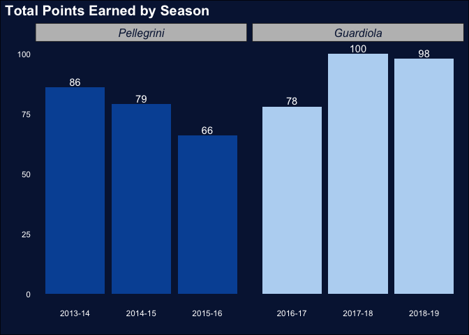
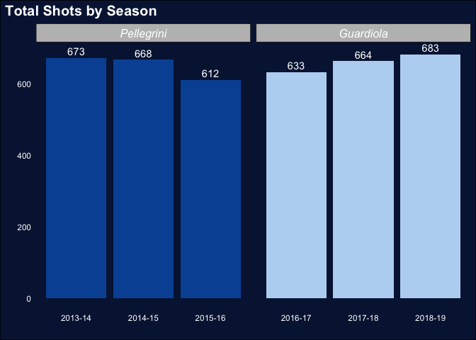

### I. Introduction

  Pep Guardiola is considered to be one of the greatest tactical masterminds in modern football. He is a coach who possesses all the skills and experience to transform any team into a dominant champion in any worldwide competition. As a manager, Guardiola holds the record for the most consecutive league games won in La Liga (Spain), the Bundesliga (Germany), and the English Premier League. Guardiola has managed to win a total of 30 trophies in his career as manager of Barcelona, Bayern Munich, and his current club, Manchester City. How did Guardiola change the style of play and influence the performance of English football club Manchester City after his appointment as manager in July 2016?  

  The purpose of this study is to perform a comparative analysis of the style of play and performance of the football club Manchester City before and after the appointment of Pep Guardiola. We will evaluate data from the 2013-14 English Premier League season through the 2018-19 season. During the first three seasons covered in our analysis (2013-14, 2014-15, 2015-16), Manuel Pellegrini served as manager of Manchester City, leading them to one Premier League title in the 2013-14 season. Following the removal of Pelligrini in June 2016, Pep Guardiola was appointed manager and expectations quickly mounted for him to completely change Manchester City's style of play with his world famous Tika-Taka style.

  In order to answer our primary research question, we will explore the following secondary research questions:
  
· How did Manchester City perform during Pellegrini's tenure as manager compared to during Guardiola's tenure?

· How did Manchester City perform offensively over the seasons?

· How did Manchester City perform defensively over the seasons?

  As football players and fans, it is hard not to admire the characteristic style of play of Guardiola's teams and the way he is consistently able to build his teams into the dominant force in their respective leagues. In the documentary "All or Nothing: Manchester City", it is crystal clear that Guardiola has a remarkable obsession with the tactical side of soccer and the style of play of his side. Everything Guardiola does as a manager seems to stem from an almost pathological attention to detail. As any football player will tell you, small details, performed consistently over time, can make the difference needed to crown a team champion at the end of the season. We are motivated to achieve a better understanding of these details through this analysis. 

  This study is divided into six sections. The following section includes a biography of Pep Guardiola, including his time as a professional football player and as a coach. Next, we will present the style of play Guardiola has implemented at Manchester City and how it has changed over the seasons. We will then introduce our data before analyzing the results of various statistical transformations and visualizations. In the fifth section, we will summarize our findings and provide limitations and future research possibilities as an extension to this study. 

### II. Pep Guardiola

  Guardiola spent the majority of his playing career as a defensive midfielder for Spanish club Barcelona. Johan Cruyff, one of football's most legendary players, as manager of Barcelona, transformed the club into a celebrated champion, with Guardiola playing a central role, as they won the club's first ever European Cup in 1992 and four La Liga titles from 1991 to 1994. Guardiola also captained Barcelona from 1997 until his departure from the club in 2001. He earned 47 caps (appearances) for the Spanish national team, and was part of the team at the 1994 World Cup and Euro 2000. After his retirement as a player, Guardiola became the coach of Barcelona B. After being appointed as manager of Barcelona's first team in May 2008, Guardiola immediately made his mark by telling key players like Ronaldinho, Deco, and Samuel Eto'o that they were not part of his plans. Guardiola then went on to sign defenders Dani Alves and Gerard Piqué, and promoted youth players Sergio Busquets and Pedro to the first team. All three of these players would go on to be key figures in Barcelona's era of dominance in modern football. In his first season at Barcelona, Guardiola guided his side to the treble: winning La Liga, La Copa del Rey, and the UEFA Champions League. This feat made him the youngest ever manager to accomplish this. When Guardiola left the club in 2012, he had won 14 trophies as manager of Barcelona, a historical club record. 

*[Source: https://www.kicker.de/fc-bayern-muenchen/team-trainer/bundesliga/2013-14]*

*[Source: https://www.nytimes.com/2018/04/06/sports/soccer/manchester-city-united-pep-guardiola.html]*

  After a short sabbatical and an intensive German language course, Guardiola was announced as the new manager of Bayern Munich in 2013. During his time at one of the greatest clubs in the history of football, Guardiola won the Bundesliga in three consecutive seasons, including two domestic doubles. 

  While Guardiola's Bayern side won a domestic double in his final year in 2016, Manchester City only managed to take fourth place in the English Premier League. The fourth place finish qualified City for a spot in next season's Champions League, an annual club football competition contested by the top clubs in Europe. In February of 2016, Manchester City announced the appointment of Pep Guardiola as manager for their upcoming season. Many blame the subpar performance of Manchester City during the 2015-16 season and the failure of Manuel Pelligrini during his final season in charge on this mid-season announcement of Guardiola's impending arrival. Before Pep's appointment was announced, Manchester City were only three points short of first place in the Premier League. By the end of the season, they had fell 15 points behind champion Leicester City and only barely qualified for the group stage of next season's Champions League. During Pellegrini's tenure at Manchester City from 2013 to 2016, he managed to win one Premier League title and two League Cups. 

*[Source: https://www.manchestereveningnews.co.uk/sport/football/football-news/man-city-pellegrini-guardiola-destabilising-11336011]*

  During Guardiola's first year as a Manchester City manager, he signed critical players, such as Oleksandr Zinchenko, Leroy Sané, İlkay Gündoğan, Claudio Bravo, and Gabriel Jesus. Guardiola is known for transforming the playing style of any new team he manages. Doing so requires making signings that fit into his desired style of play and plan for the team. During a disappointing 2016-17 season at Manchester City, Guardiola did not manage to win any trophies. However, his first season in charge allowed him to identify the changes necessary to improve the team in the battle for the Premier League title in the upcoming 2017-18 season. He made new acquisitions in the summer transfer window, signing goalkeeper Ederson Moraes, midfielder Bernardo Silva, as well as full-backs Danilo, Benjamin Mendy, and Kyle Walker, while dropping all four senior full backs from his team. The Manchester City squad had the fourth highest average squad age in the entire Premier League during the 2016-17 season, which explains some of Guardiola's challenges during his first season in charge. The signings made in the lead up to the 2017-18 season made Manchester City the 6th youngest squad in the league. 

  In the weeks leading up to the final part of the 2017-18 season, Guardiola had managed to put Manchester City in a position to break several Premier League records. On 15 April 2018, Manchester City won the Premier League with the most wins (32) in league history, most away wins (16) in league history, most points (100) in league history, and the most goals (106) in league history. 2017-18 was a historical Premier League season for Manchester City and Guardiola's first title in England. Manchester City also managed to win the EFL Cup with a 3-0 victory over Arsenal. However, City were knocked out of the Champions League after losing both legs of their quarterfinal against Liverpool. 

  During Guardiola's third season in charge, he signed attacking midfielder Riyad Mahrez from Leicester City for a fee of £60 million. Manchester City had fully adapted Guardiola's style of play and dominated the Premier League in the previous season. They immediately started their 2018-19 season with a trophy, the 2018 FA Community Shield, with a victory over Chelsea. In the 2018-19 season, Guardiola faced one of his biggest challenges as the manager of Manchester City. In order to win the title, Manchester City had to win 14 games in a row. Guardiola called it one of the toughest challenges in all his career. However, after all 38 games were played, Manchester City was once again on top of the league with 98 points, one point above Liverpool. City finished the 2018-19 season with 32 wins and an impressive 95 goals scored. Besides the FA Community Shield and Premier League title, Manchester City also managed to win the FA Cup and became one of the first ever men's teams in England to win the domestic treble. 

### III. Guardiola's Style of Play

**General**

The style of play characteristic of teams coached by Pep Guardiola can be summarized by five pillars:

1. A high percentage of possession.

2. A high number of passes completed and a high percentage of passes completed.

3. Pushing the full-backs high into the attack to provide crosses.

4. An ability to keep possession under high pressure and to play the ball out from the back. 

5. Pressing and winning the ball back quickly once they lose possession. 

**Guardiola's Style of Play over The Years**

  Below, we will identify key elements of Manchester City's team and how their style of play changed over the different seasons with Guardiola as manager.
  
**2016-2017 Season**

· Pep struggled to find his best XI during the 2016-17 season and experimented with eight different formations in 38 Premier League matches. 

· Most often, Manchester City played in a 4-3-3 formation. In this formation, Kevin de Bruyne and David Silva were assigned the "free 8" roles in the midfield, advancing to the "10" (attacking midfield) positions in possession and drawing back to the "6" (defensive midfield) positions in defense.  

· When Manchester City had possession in their own half, the defensive midfielder, Fernandinho, dropped in between the two center-backs, who spread wide. Kolarov, as a left-footed left center-back was able to distribute the ball to both wingers as he averaged the most long passes per match for Manchester City during the 2016-17 season (4.2 long passes per game on average).

· At Barcelona and Bayern Munich, Pep Guardiola had full-backs who were capable of dominating the entire left and right flank. However, during the 2016-17 season with Manchester City, Guardiola's full-backs were older players who proved to be incapable of fitting into his desired style of play. 

· Guardiola played with a 3-2-5 formation in attack with the two center-backs and the "6" in the back, both full-backs in front of them to secure the midfield, pushing up the "8s" (box-to-box midfield), Kevin de Bruyne and David Silva, into advanced "10" positions in support of the attacking front 3 players. This was done in possession in the opponent's half of the field with the aim of congesting the center of the field in order to prevent counterattacks. 

· One of the main challenges in this season was build-up play. Both full-backs who controlled the midfield in possession were not good enough on the ball, which slowed down the ball progression and therefore hindered City's attack. 

· Despite facing these challenges, there was an overall improvement in the 2016-17 season as Manchester City scored more goals, had a higher average possession percentage, and a higher passing average per game than during the 2015-16 season under Pellegrini. 

· Ultimately, Manchester City lost in the fourth round of the Carabao Cup, the semi-finalls of the FA Cup, and the Round of 16 of the Champions League. On top of all of this, they were only able to secure third place in the Premier League, finishing 15 points behind Premier League champion Chelsea. 

**2017-2018 Season**

· With the signings of full-backs Danilo, Benjamin Mendy, and Kyle Walker, Pep Guardiola changed to a 5-3-2 formation. He was able to change from a 4-3-3 formation to a 5-3-2 formation because his full-backs were able to dominate the entire flank and therefore fit better into Guardiola's desired style of play.

· Due to an early season injury of Mendy (the left full-back), Pep Guardiola changed back to the 4-3-3 formation while transforming central midfielder Fabian Delph into a left full-back. 

· New goalkeeper Ederson Moraes became vital in Guardiola's style of play as he was able to comfortably become part of Manchester City's possession game, building out from the back as well as playing long range passes with extreme precision. This allowed Manchester City to easily break pressure from the opponent in their own half with Ederson playing accurate long range passes over the opponent's lines, allowing the City forwards to make penetrating runs behind. 

· In Manchester City's build-up play, the full-backs played a key role. Left-back Delph would tuck into the midfield, creating a three-player back line with Walker to the right of the center-backs. This allowed Fernandinho to get possession in the midfield instead of dropping in between the two center-backs like he had done during the 2016-17 season. During the 2017-18 season, Fernandinho increased in his average number of passes per game from 68 to 88, and thus was able to dictate City's build-up play. 

· The Delph and Fernandinho combination in midfield increased the speed of City's build-up play compared to the duo of Bacary Sagna & Gael Clichy in the previous season. At the same time, right-back Kyle Walker had a better understanding of his role as a full-back and was able to determine when to stay behind as a center-back and when to push higher up to join the attack and serve crosses. 

· Both Kevin de Bruyne and David Silva kept similar roles to the 2016-17 season, but now had the ability to come into positions to influence the opponent's midfielders and entire defense line with their play. They were able to choose between making penetrating passes to their wingers behind the opponent's back line, combination passes with the striker, crossing from the outside the box, and taking direct shots on goal. 

· The key changes to Manchester City's style of play and the new signings that fit into this style of play brought Manchester City a historic season:

  - 32 wins (most in Premier League history)
  
  - 16 away wins (most in Premier League history)
  
  - 100 points (most in Premier League history)
  
  - 106 goals (most in Premier League history)
  
  - 19 point title winning margin (biggest in Premier League history)
  
· Manchester City and Pep Guardiola also managed to win the EFL cup during this season, but were knocked out of the Champions League quarterfinal by Premier League opponent, Liverpool.

**2018-2019 Season**

· For this season, Guardiola only signed attacking midfielder Mahrez and kept a very similar first team squad compared to the previous season.

· Guardiola made minor tweaks to his style of play rather than major changes as his team had become more accustomed to his football philosophy. One of the tweaks he made was to increase the involvement of full-backs Kyle Walker and Oleksandr Zinchenko. Zinchenko's speed allowed him to dominate the left flank more consistently than Delph had in the previous season. This allowed wingers Raheem Sterling and Leroy Sané to play more centrally (closer to the box), with Walker and Zichenko providing crosses from wide positions. 

· Injury challenges during this season forced Guardiola to pivot his starting XI and change their style of play. He would often play Fernandinho as a center-back instead of as a defensive midlfielder and start Aymeric LaPorte as a left-back instead of his usual position of center-back. In possession, Fernandinho would be able to overload the midfield, dictating the build-up play with the support of David Silva, City's central midfielder.

· Manchester City continued to dominate competitions in England, winning the Premier League, Carabao Cup, and the FA Cup, to become one of the first ever men's teams in England to win the domestic treble.

*[Source: https://www.youtube.com/watch?v=1gHq-yspmso]*

### IV. Data

  In order to examine how the style of play and performance of football club Manchester City changed after the appointment of their current manager, Pep Guardiola, data from the 2013-14 season through the 2018-19 season has been drawn from Football Data – a football portal providing historical data on any competition worldwide, that includes information on every Premier League game. Football Data provides all data sets in Excel and CSV format for quantitative analysis. The variables in this Premier League data set include:

· Date = Match Date (dd/mm/yy)

· Time = Time of match kick off

· HomeTeam = Home Team

· AwayTeam = Away Team

· FTHG and HG = Full Time Home Team Goals

· FTAG and AG = Full Time Away Team Goals

· FTR and Res = Full Time Result (H=Home Win, D=Draw, A=Away Win)

· HTHG = Half Time Home Team Goals

· HTAG = Half Time Away Team Goals

· HTR = Half Time Result (H=Home Win, D=Draw, A=Away Win)

· Attendance = Crowd Attendance

· Referee = Match Referee

· HS = Home Team Shots

· AS = Away Team Shots

· HST = Home Team Shots on Target

· AST = Away Team Shots on Target

· HHW = Home Team Hit Woodwork

· AHW = Away Team Hit Woodwork

· HC = Home Team Corners

· AC = Away Team Corners

· HF = Home Team Fouls Committed

· AF = Away Team Fouls Committed

· HFKC = Home Team Free Kicks Conceded

· AFKC = Away Team Free Kicks Conceded

· HO = Home Team Offsides

· AO = Away Team Offsides

· HY = Home Team Yellow Cards

· AY = Away Team Yellow Cards

· HR = Home Team Red Cards

· AR = Away Team Red Cards

· HBP = Home Team Bookings Points (10 = yellow, 25 = red)

· ABP = Away Team Bookings Points (10 = yellow, 25 = red)

  In order to perform a more thorough analysis of Guardiola's impact at Manchester City, data from the 2013-14 through the 2018-19 season has been drawn from the official Premier League website. The statistics page on the Premier League website provides data on any season as well as individual football club. For our analysis, we will be using the following variables: passes (total), passes per match, pass accuracy %, crosses, cross accuracy %, tackles, and interceptions. The Premier League website does not provide any data sets in Excel and CSV format, and we have therefore transformed the information into a data set in Excel format for our analysis. 

[Source: http://www.football-data.co.uk/data.php]

[Source: https://www.premierleague.com/stats]

### V. Results

  To start our analysis of Pep Guardiola's impact on the style of play and performance of Manchester City after his appointment in 2016, we will attempt to answer our secondary research questions. 
  
  First: How did Manchester City perform during Guardiola's tenure as manager compared to during Pelligrini's tenure? We will use the total points earned by Manchester City in the Premier League in the final three seasons of Pellegrini's tenure (2013-14, 2014-15, 2015-16) and in the first three seasons of Guardiola's tenure (2016-17, 2017-18, 2018-19) as the primary comparison point. 

<!-- -->

The bar chart above displays the total points earned by Manchester City in their final three seasons under Pelligrini and in their first three seasons under Guardiola. From a cursory look at the graph, it is clear that overall, Manchester City earned more points in their seasons under Guardiola than in their seasons under Pelligrini. The two highest total point seasons for Manchester City come in 2017-18 and 2018-19, their second and third years under Guardiola, respectively.

<!--html_preserve-->

<table class="gt_table">
  <thead class="gt_header">
    <tr>
      <th colspan="4" class="gt_heading gt_title gt_font_normal" style><strong>Average Points Statistics Under Each Manager</strong></th>
    </tr>
    <tr>
      <th colspan="4" class="gt_heading gt_subtitle gt_font_normal gt_bottom_border" style></th>
    </tr>
  </thead>
  <thead class="gt_col_headings">
    <tr>
      <th class="gt_col_heading gt_columns_bottom_border gt_left" rowspan="1" colspan="1"></th>
      <th class="gt_col_heading gt_columns_bottom_border gt_right" rowspan="1" colspan="1">ManagerPoints</th>
      <th class="gt_col_heading gt_columns_bottom_border gt_right" rowspan="1" colspan="1">ManagerPPG</th>
      <th class="gt_col_heading gt_columns_bottom_border gt_right" rowspan="1" colspan="1">SeasonPPG</th>
    </tr>
  </thead>
  <tbody class="gt_table_body">
    <tr class="gt_group_heading_row">
      <td colspan="4" class="gt_group_heading">Pellegrini</td>
    </tr>
    <tr>
      <td class="gt_row gt_left gt_stub">2013-14</td>
      <td class="gt_row gt_right">77</td>
      <td class="gt_row gt_right">2.026316</td>
      <td class="gt_row gt_right">2.263158</td>
    </tr>
    <tr>
      <td class="gt_row gt_left gt_stub">2014-15</td>
      <td class="gt_row gt_right">77</td>
      <td class="gt_row gt_right">2.026316</td>
      <td class="gt_row gt_right">2.078947</td>
    </tr>
    <tr>
      <td class="gt_row gt_left gt_stub">2015-16</td>
      <td class="gt_row gt_right">77</td>
      <td class="gt_row gt_right">2.026316</td>
      <td class="gt_row gt_right">1.736842</td>
    </tr>
    <tr class="gt_group_heading_row">
      <td colspan="4" class="gt_group_heading">Guardiola</td>
    </tr>
    <tr>
      <td class="gt_row gt_left gt_stub">2016-17</td>
      <td class="gt_row gt_right">92</td>
      <td class="gt_row gt_right">2.421053</td>
      <td class="gt_row gt_right">2.052632</td>
    </tr>
    <tr>
      <td class="gt_row gt_left gt_stub">2017-18</td>
      <td class="gt_row gt_right">92</td>
      <td class="gt_row gt_right">2.421053</td>
      <td class="gt_row gt_right">2.631579</td>
    </tr>
    <tr>
      <td class="gt_row gt_left gt_stub">2018-19</td>
      <td class="gt_row gt_right">92</td>
      <td class="gt_row gt_right">2.421053</td>
      <td class="gt_row gt_right">2.578947</td>
    </tr>
  </tbody>
  
  
</table>
<!--/html_preserve-->

  To gain more insight into City's total points under the two managers, we calculated a few averages: the average points earned by each manager, Manchester City's average points per game (PPG) by season, and the average PPG for each manager.

  In their final three seasons under Pelligrini, Manchester City earned an average of 77 points. In their first three seasons under Guardiola, the club earned an average of 92 points.

  In terms of Points Per Game (PPG), Manchester City had their highest PPG in the 2017-18 season (2.63; Guardiola), their second highest PPG in the 2018-19 season (2.58; Guardiola), and their third highest PPG in the 2013-14 season (2.26; Pelligrini). It is interesting to note that in each of these three seasons, Manchester City finished as Premier League champions.

  Manchester City's average PPG under Pelligrini was 2.02, while under Guardiola, their average PPG was 2.42. 

  Next, we look at the points Manchester City earns in matches played at home and in matches played away from home. 

<!-- -->

  At first glance, it is not immediately clear whether there are trends in the graph above. However, if we focus only on points earned away from home (navy blue bars), it is clear that under Guardiola, Manchester City fared much better than under Pellegrini. In each of the first three seasons with Guardiola as manager, City's points earned away exceeded their points earned away in all of their final three seasons under Pelligrini (including the 2013-14 season in which City earned 86 total points and finished as champions). 

  In terms of points earned at home, differences between the two managers are not so clear. But, it is interesting to notice the trend within City's three seasons under each each manager. In the final seasons under Pelligrini, Manchester City's points earned at home decrease steadily: from 52 to 45 and finally to 38. In their first three seasons under Guardiola, City's home points increase steadily: from 40 to 50 and then to 54.

<!--html_preserve-->

<table class="gt_table">
  <thead class="gt_header">
    <tr>
      <th colspan="7" class="gt_heading gt_title gt_font_normal" style><strong>Average Home/Away Points Statistics Under Each Manager</strong></th>
    </tr>
    <tr>
      <th colspan="7" class="gt_heading gt_subtitle gt_font_normal gt_bottom_border" style></th>
    </tr>
  </thead>
  <thead class="gt_col_headings">
    <tr>
      <th class="gt_col_heading gt_columns_bottom_border gt_left" rowspan="1" colspan="1"></th>
      <th class="gt_col_heading gt_columns_bottom_border gt_right" rowspan="1" colspan="1">ManagerHomePoints</th>
      <th class="gt_col_heading gt_columns_bottom_border gt_right" rowspan="1" colspan="1">ManagerAwayPoints</th>
      <th class="gt_col_heading gt_columns_bottom_border gt_right" rowspan="1" colspan="1">SeasonHomePPG</th>
      <th class="gt_col_heading gt_columns_bottom_border gt_right" rowspan="1" colspan="1">SeasonAwayPPG</th>
      <th class="gt_col_heading gt_columns_bottom_border gt_right" rowspan="1" colspan="1">ManagerHomePPG</th>
      <th class="gt_col_heading gt_columns_bottom_border gt_right" rowspan="1" colspan="1">ManagerAwayPPG</th>
    </tr>
  </thead>
  <tbody class="gt_table_body">
    <tr class="gt_group_heading_row">
      <td colspan="7" class="gt_group_heading">Pellegrini</td>
    </tr>
    <tr>
      <td class="gt_row gt_left gt_stub">2013-14</td>
      <td class="gt_row gt_right">45</td>
      <td class="gt_row gt_right">32</td>
      <td class="gt_row gt_right">2.736842</td>
      <td class="gt_row gt_right">1.789474</td>
      <td class="gt_row gt_right">2.368421</td>
      <td class="gt_row gt_right">1.684211</td>
    </tr>
    <tr>
      <td class="gt_row gt_left gt_stub">2014-15</td>
      <td class="gt_row gt_right">45</td>
      <td class="gt_row gt_right">32</td>
      <td class="gt_row gt_right">2.368421</td>
      <td class="gt_row gt_right">1.789474</td>
      <td class="gt_row gt_right">2.368421</td>
      <td class="gt_row gt_right">1.684211</td>
    </tr>
    <tr>
      <td class="gt_row gt_left gt_stub">2015-16</td>
      <td class="gt_row gt_right">45</td>
      <td class="gt_row gt_right">32</td>
      <td class="gt_row gt_right">2.000000</td>
      <td class="gt_row gt_right">1.473684</td>
      <td class="gt_row gt_right">2.368421</td>
      <td class="gt_row gt_right">1.684211</td>
    </tr>
    <tr class="gt_group_heading_row">
      <td colspan="7" class="gt_group_heading">Guardiola</td>
    </tr>
    <tr>
      <td class="gt_row gt_left gt_stub">2016-17</td>
      <td class="gt_row gt_right">48</td>
      <td class="gt_row gt_right">44</td>
      <td class="gt_row gt_right">2.105263</td>
      <td class="gt_row gt_right">2.000000</td>
      <td class="gt_row gt_right">2.526316</td>
      <td class="gt_row gt_right">2.315789</td>
    </tr>
    <tr>
      <td class="gt_row gt_left gt_stub">2017-18</td>
      <td class="gt_row gt_right">48</td>
      <td class="gt_row gt_right">44</td>
      <td class="gt_row gt_right">2.631579</td>
      <td class="gt_row gt_right">2.631579</td>
      <td class="gt_row gt_right">2.526316</td>
      <td class="gt_row gt_right">2.315789</td>
    </tr>
    <tr>
      <td class="gt_row gt_left gt_stub">2018-19</td>
      <td class="gt_row gt_right">48</td>
      <td class="gt_row gt_right">44</td>
      <td class="gt_row gt_right">2.842105</td>
      <td class="gt_row gt_right">2.315789</td>
      <td class="gt_row gt_right">2.526316</td>
      <td class="gt_row gt_right">2.315789</td>
    </tr>
  </tbody>
  
  
</table>
<!--/html_preserve-->

  To compare City's points earned at home and away under each manager in more depth, we calculated a few averages: the average points earned at home/away by each manager, the average home/away PPG by season, and the average home/away PPG by manager.

  Manchester City's average home points under Pelligrini was 45. Under Guardiola, it was 48. City's average away points under Pelligrini was 32. Under Guardiola, this number jumps to 44.

  Manchester City's highest average home PPG occurred in the 2018-19 season (2.84; Guardiola), the second highest average home PPG in 2013-14 (2.74; Pelligrini), and the third highest in 2017-18 (2.63; Guardiola). Manchester City's highest average away PPG occurred in the 2017-18 season (2.63; Guardiola), the second highest in 2018-19 (2.32; Guardiola), and the third highest in 2016-17 (2.00; Guardiola).

  Manchester City's average home PPG in their final three seasons under Pelligrini was 2.37. Their average home PPG in their first three seasons under Guardiola was 2.53. City's average away PPG under Pelligrini was a mere 1.68, while under Guardiola it was 2.32.

  Our second secondary research question regards the differences in Manchester City's passing statistics under Pelligrini and under Guardiola. Before performing any analysis of the data, we anticipated that passing statistics would be a point of major difference between the two managers. As we mentioned earlier, Guardiola's sides are notorious for maintaining a high percentage of ball possession in matches, completing a high number of passes in their matches (with a high passing percentage), and winning the ball back quickly once they lose it. Pelligrini's sides typically do not do these things to nearly the same extent.   

<!-- -->

  The graph above utilizes data taken from the official Premier League website and illustrates Manchester City's average passes per match in each of their final three seasons under Pelligrini and each of their first three seasons under Guardiola. As you can see, our initial prediction regarding the differences in passing statistics between Pelligrini's and Guardiola's side proved to be correct. In Guardiola's first season in charge (2016-17), City's average passes per match was 597.53. This number is higher than in any of their final three seasons under Pelligrini, despite being by far the lowest average passes per match in any of Guardiola's first three seasons. After the 2016-17 season, City's average passes per match jumps up dramatically (by more than 100 passes per match) to 743.18 in 2017-18 and 699.5 in 2018-19. This considerable increase in average passes per match indicates Guardiola's success in adapting Manchester City's style of play to his possession-oriented style, after his first season where City played a style more similar to the one they had under Pelligrini. 

<!--html_preserve-->

<table class="gt_table">
  <thead class="gt_header">
    <tr>
      <th colspan="4" class="gt_heading gt_title gt_font_normal" style><strong>Average Passing Statistics Under Each Manager</strong></th>
    </tr>
    <tr>
      <th colspan="4" class="gt_heading gt_subtitle gt_font_normal gt_bottom_border" style></th>
    </tr>
  </thead>
  <thead class="gt_col_headings">
    <tr>
      <th class="gt_col_heading gt_columns_bottom_border gt_left" rowspan="1" colspan="1"></th>
      <th class="gt_col_heading gt_columns_bottom_border gt_right" rowspan="1" colspan="1">SeasonPassesManager</th>
      <th class="gt_col_heading gt_columns_bottom_border gt_right" rowspan="1" colspan="1">MatchPassesManager</th>
      <th class="gt_col_heading gt_columns_bottom_border gt_right" rowspan="1" colspan="1">PassAccuracyManager</th>
    </tr>
  </thead>
  <tbody class="gt_table_body">
    <tr class="gt_group_heading_row">
      <td colspan="4" class="gt_group_heading">Pellegrini</td>
    </tr>
    <tr>
      <td class="gt_row gt_left gt_stub">2013-14</td>
      <td class="gt_row gt_right">21118.67</td>
      <td class="gt_row gt_right">555.7233</td>
      <td class="gt_row gt_right">84.66667</td>
    </tr>
    <tr>
      <td class="gt_row gt_left gt_stub">2014-15</td>
      <td class="gt_row gt_right">21118.67</td>
      <td class="gt_row gt_right">555.7233</td>
      <td class="gt_row gt_right">84.66667</td>
    </tr>
    <tr>
      <td class="gt_row gt_left gt_stub">2015-16</td>
      <td class="gt_row gt_right">21118.67</td>
      <td class="gt_row gt_right">555.7233</td>
      <td class="gt_row gt_right">84.66667</td>
    </tr>
    <tr class="gt_group_heading_row">
      <td colspan="4" class="gt_group_heading">Guardiola</td>
    </tr>
    <tr>
      <td class="gt_row gt_left gt_stub">2016-17</td>
      <td class="gt_row gt_right">25842.67</td>
      <td class="gt_row gt_right">680.0700</td>
      <td class="gt_row gt_right">88.00000</td>
    </tr>
    <tr>
      <td class="gt_row gt_left gt_stub">2017-18</td>
      <td class="gt_row gt_right">25842.67</td>
      <td class="gt_row gt_right">680.0700</td>
      <td class="gt_row gt_right">88.00000</td>
    </tr>
    <tr>
      <td class="gt_row gt_left gt_stub">2018-19</td>
      <td class="gt_row gt_right">25842.67</td>
      <td class="gt_row gt_right">680.0700</td>
      <td class="gt_row gt_right">88.00000</td>
    </tr>
  </tbody>
  
  
</table>
<!--/html_preserve-->

  To examine the differences in Manchester City's passing statistics during Pelligrini's and Guardiola's tenures in more depth, we calculated three more average passing statistics: average passes per season under each manager, average passes per match under each manager, and average pass accuracy under each manager.

  In Pelligrini's final three seasons in charge, Manchester City averaged 21,118.67 passes per season. In Guardiola's first three seasons in charge, City averaged 25,842.67 passes per season, a difference of more than 4,500 passes.

  Under Pelligrini, Manchester City averaged 555.72 passes per match. Under Guardiola, this number jumps to 680.07, a difference of more than 120 passes per match.

  Under Pelligrini, Manchester City maintained an average pass accuracy of 84.67%. Under Guardiola, City's average pass accuracy was 88.00%, a difference of 3.33%. While this may seem like an inconsequential difference, it is important to remember that Guardiola's teams were completing on average more than 120 passes per match more than Pelligrini's teams, which makes their higher pass accuracy all the more impressive.

  All in all, our analysis of Manchester City's passing statistics in the final three years of Pelligrini's tenure and the first three years of Guardiola's tenure yielded the results we were expecting. City's significantly higher average passes per match and their higher passing accuracy percentage under Guardiola illustrates how Guardiola was able to mold the team in accordance with his possession-oriented philosophy. Guardiola transformed Manchester City into a club that dominated possession, relied on short, accurate passes to move the ball around the field, and pressed relentlessly to win the ball back when they turned it over.  

**Manchester City's offensive performance**

  Continuing our analysis of Pep Guardiola's impact on the style of play and performance of Manchester City after his appointment in 2016, we will now evaluate Manchester City's offensive performance over the seasons. We will use the total goals scored by Manchester City in the final three seasons of Pellegrini's tenure (2013-14, 2014-15, 2015-16) and in the first three seasons of Guardiola's tenure (2016-17, 2017-18, 2018-19) as the primary comparison point. We will then examine in detail the total shots and total shots on target to get a better understanding of Manchester City's performance in front of the opponent's goal. Lastly, we will assess the total number of crosses over the seasons. This will allow us to gain a deeper understanding of the style of play employed Manchester City in offense under Pelligrini and Guardiola over the seasons. 

<!-- -->

  The bar chart above displays the total goals scored by Manchester City in the 2013-14 season through the 2018-19 season. At first glance, the 2013-14 season under Pellegrini and the 2017-18 season under Guardiola stand out because of the high number of goals scored in both seasons. Manchester City, under Pelligrini, scored 102 goals in the 2013-14 season, the second highest number of goals scored by a Premier League team in a single season. However, Manchester City broke their own record in the 2017-18 season under Guardiola, scoring 106 goals. Manchester City's impressive goal tally helped them earn a total of 100 points, which was enough to crown them Premier League champions in the 2017-18 season. 

<!--html_preserve-->

<table class="gt_table">
  <thead class="gt_header">
    <tr>
      <th colspan="4" class="gt_heading gt_title gt_font_normal" style><strong>Average Goals For Statistics Under Each Manager</strong></th>
    </tr>
    <tr>
      <th colspan="4" class="gt_heading gt_subtitle gt_font_normal gt_bottom_border" style></th>
    </tr>
  </thead>
  <thead class="gt_col_headings">
    <tr>
      <th class="gt_col_heading gt_columns_bottom_border gt_left" rowspan="1" colspan="1"></th>
      <th class="gt_col_heading gt_columns_bottom_border gt_right" rowspan="1" colspan="1">TotalGoals</th>
      <th class="gt_col_heading gt_columns_bottom_border gt_right" rowspan="1" colspan="1">ManagerGPG</th>
      <th class="gt_col_heading gt_columns_bottom_border gt_right" rowspan="1" colspan="1">SeasonGPG</th>
    </tr>
  </thead>
  <tbody class="gt_table_body">
    <tr class="gt_group_heading_row">
      <td colspan="4" class="gt_group_heading">Pellegrini</td>
    </tr>
    <tr>
      <td class="gt_row gt_left gt_stub">2013-14</td>
      <td class="gt_row gt_right">85.33333</td>
      <td class="gt_row gt_right">2.245614</td>
      <td class="gt_row gt_right">2.684211</td>
    </tr>
    <tr>
      <td class="gt_row gt_left gt_stub">2014-15</td>
      <td class="gt_row gt_right">85.33333</td>
      <td class="gt_row gt_right">2.245614</td>
      <td class="gt_row gt_right">2.184211</td>
    </tr>
    <tr>
      <td class="gt_row gt_left gt_stub">2015-16</td>
      <td class="gt_row gt_right">85.33333</td>
      <td class="gt_row gt_right">2.245614</td>
      <td class="gt_row gt_right">1.868421</td>
    </tr>
    <tr class="gt_group_heading_row">
      <td colspan="4" class="gt_group_heading">Guardiola</td>
    </tr>
    <tr>
      <td class="gt_row gt_left gt_stub">2016-17</td>
      <td class="gt_row gt_right">93.66667</td>
      <td class="gt_row gt_right">2.464912</td>
      <td class="gt_row gt_right">2.105263</td>
    </tr>
    <tr>
      <td class="gt_row gt_left gt_stub">2017-18</td>
      <td class="gt_row gt_right">93.66667</td>
      <td class="gt_row gt_right">2.464912</td>
      <td class="gt_row gt_right">2.789474</td>
    </tr>
    <tr>
      <td class="gt_row gt_left gt_stub">2018-19</td>
      <td class="gt_row gt_right">93.66667</td>
      <td class="gt_row gt_right">2.464912</td>
      <td class="gt_row gt_right">2.500000</td>
    </tr>
  </tbody>
  
  
</table>
<!--/html_preserve-->

  To gain more insight into Manchester City's total goals under Pellegrini and Guardiola, we calculated a few averages: the average goals scored under each manager, average goals scored per game (GPG) under each manager, and the average GPG for each season. 

  In the final three seasons under Pelligrini's management, Manchester City scored an average of 85.3 goals. In the first three seasons under Guardiola's management, the club scored an average of 93.7 goals. 

  Manchester City's average GPG under Pelligrini was 2.25, while under Guardiola, their average GPG was 2.46. 

  A further evaluation show that Manchester City had their highest GPG in the 2017-18 season (2.79; Guardiola), their second highest GPG in the 2013-14 season (2.68; Pellegrini), and their third highest GPG in the 2018-19 season (2.50; Guardiola). As discussed earlier, the club also had their highest PPG during these three seasons which crowned them Premier League champions in all three years. 

  Next, we evaluate the total shots and total shots on target by Manchester City to further examine their performance offensively.

<!-- -->

  At first glimpse, we see a clear pattern in the club's total shots under both Pellegirini's and Guardiola's management. With Pellegrini as manager, Manchester City's total shots gradually declined during his first two seasons, from 673 shots during the 2013-14 season to 668 shots during the 2014-15 season, with an even sharper decline in the 2015-16 season with a total of 612 shots. Under Guardiola's management, the club's total shots steadily increased from 663 in his first season to a total of 683 shots in his third season. To further examine the impact of the total shots under the different managers, it's important to evaluate City's total number of shots on target. 

<!-- -->

  The graph above displays the total shots on target by season under the different managers. In this graph, we see a similar pattern to the total shots by season. Under Pellegrini's management, the total shots on target gradually declined over the years: from 238 in the 2013-14 season to 210 in the 2015-16 season. During Guardiola's tenure, the club managed to significantly increase the total shots on target in his first two seasons with a small decline in the 2018-19 season: from 217 to 261 and finally to 260. To further examine the impact of the total shots on target under the two managers across different seasons, we will evaluate a few averages: shot accuracy (AKA shot on target percentage: total shots on target / total shots) under each manager, shot accuracy at home/away under each manager, shot accuracy by season,  and shot accuracy at home/away by season. 

<!--html_preserve-->

<table class="gt_table">
  <thead class="gt_header">
    <tr>
      <th colspan="7" class="gt_heading gt_title gt_font_normal" style><strong>Average Shots on Target Statistics Under Each Manager</strong></th>
    </tr>
    <tr>
      <th colspan="7" class="gt_heading gt_subtitle gt_font_normal gt_bottom_border" style></th>
    </tr>
  </thead>
  <thead class="gt_col_headings">
    <tr>
      <th class="gt_col_heading gt_columns_bottom_border gt_left" rowspan="1" colspan="1"></th>
      <th class="gt_col_heading gt_columns_bottom_border gt_right" rowspan="1" colspan="1">SOTManager</th>
      <th class="gt_col_heading gt_columns_bottom_border gt_right" rowspan="1" colspan="1">HomeSOTManager</th>
      <th class="gt_col_heading gt_columns_bottom_border gt_right" rowspan="1" colspan="1">AwaySOTManager</th>
      <th class="gt_col_heading gt_columns_bottom_border gt_right" rowspan="1" colspan="1">SOTSeason</th>
      <th class="gt_col_heading gt_columns_bottom_border gt_right" rowspan="1" colspan="1">HomeSOTSeason</th>
      <th class="gt_col_heading gt_columns_bottom_border gt_right" rowspan="1" colspan="1">AwaySOTSeason</th>
    </tr>
  </thead>
  <tbody class="gt_table_body">
    <tr class="gt_group_heading_row">
      <td colspan="7" class="gt_group_heading">Pellegrini</td>
    </tr>
    <tr>
      <td class="gt_row gt_left gt_stub">2013-14</td>
      <td class="gt_row gt_right">0.3461342</td>
      <td class="gt_row gt_right">0.3502304</td>
      <td class="gt_row gt_right">0.3410138</td>
      <td class="gt_row gt_right">0.3536404</td>
      <td class="gt_row gt_right">0.3607427</td>
      <td class="gt_row gt_right">0.3445946</td>
    </tr>
    <tr>
      <td class="gt_row gt_left gt_stub">2014-15</td>
      <td class="gt_row gt_right">0.3461342</td>
      <td class="gt_row gt_right">0.3502304</td>
      <td class="gt_row gt_right">0.3410138</td>
      <td class="gt_row gt_right">0.3413174</td>
      <td class="gt_row gt_right">0.3573407</td>
      <td class="gt_row gt_right">0.3224756</td>
    </tr>
    <tr>
      <td class="gt_row gt_left gt_stub">2015-16</td>
      <td class="gt_row gt_right">0.3461342</td>
      <td class="gt_row gt_right">0.3502304</td>
      <td class="gt_row gt_right">0.3410138</td>
      <td class="gt_row gt_right">0.3431373</td>
      <td class="gt_row gt_right">0.3314121</td>
      <td class="gt_row gt_right">0.3584906</td>
    </tr>
    <tr class="gt_group_heading_row">
      <td colspan="7" class="gt_group_heading">Guardiola</td>
    </tr>
    <tr>
      <td class="gt_row gt_left gt_stub">2016-17</td>
      <td class="gt_row gt_right">0.3727273</td>
      <td class="gt_row gt_right">0.3872778</td>
      <td class="gt_row gt_right">0.3556531</td>
      <td class="gt_row gt_right">0.3428120</td>
      <td class="gt_row gt_right">0.3422619</td>
      <td class="gt_row gt_right">0.3434343</td>
    </tr>
    <tr>
      <td class="gt_row gt_left gt_stub">2017-18</td>
      <td class="gt_row gt_right">0.3727273</td>
      <td class="gt_row gt_right">0.3872778</td>
      <td class="gt_row gt_right">0.3556531</td>
      <td class="gt_row gt_right">0.3930723</td>
      <td class="gt_row gt_right">0.4351585</td>
      <td class="gt_row gt_right">0.3470032</td>
    </tr>
    <tr>
      <td class="gt_row gt_left gt_stub">2018-19</td>
      <td class="gt_row gt_right">0.3727273</td>
      <td class="gt_row gt_right">0.3872778</td>
      <td class="gt_row gt_right">0.3556531</td>
      <td class="gt_row gt_right">0.3806735</td>
      <td class="gt_row gt_right">0.3834197</td>
      <td class="gt_row gt_right">0.3771044</td>
    </tr>
  </tbody>
  
  
</table>
<!--/html_preserve-->

  Under Pelligrini, Manchester City averaged a shot accuracy of 34.6%. Under Guardiola, this percentage increased to an average shot accuracy of 37.2%, a difference of 2.6%. While this may be considered as a small difference, the increase in average shot accuracy resulted in a higher GPG under Guardiola (2.46) than under Pelligrini (2.25). It is therefore important to recognize how small changes can increase a team's performance and the final outcome of a game. 

  In terms of Manchester City's average shot accuracy at home and away under the different managers, there is a noticeable difference in the average shot accuracy at home while there is only a slight difference in the average shot accuracy away. City's average shot accuracy at home was 35.0% under Pelligrini, while 38.7% under Guardiola, a difference of 3.7%. Manchester City recorded a lower shot accuracy away under Pelligrini with 34.1% and Guardiola with 35.6%, a moderate difference of 1.5%. 

  A closer look at the average shot accuracy by season reveals that Manchester City had the highest average shot accuracy, 39.3%, during their 2017-18 record breaking season under Guardiola. Closely followed by the 2018-19 season with shot accuracy of 38.1%. The third highest average shot accuracy of 35.4% was recorded during the 2013-14 season under Pelligrini. It is interesting to note that Manchester City scored 102 goals during the 2013-14 season and 95 goals during the 2018-19 season while the average shot accuracy was higher in the 2018-19 season (38.1%) under Guardiola than the 2013-14 season (35.4%) under Pellegrini. 

  A closer analysis of the average home/away shot accuracy by season shows that City had a higher average shot accuracy at home than away during the 2013-14, 2014-15, 2017-18, and 2018-19 seasons. However, during the 2015-16 season under Pelligrini, Manchester City had an average shot accuracy of 33.1% at home while 35.8% away, a 2.7% difference. Furthermore, during the 2016-17 season under Guardiola, they managed an average shot accuracy of 34.2% at home while 34.3% away, a 0.1% difference. During Pelligrini's last year as a manager (2015-16), Manchester City earned a total of 66 points with only 38 points at home, the lowest number of points recorded under his management. This shows how the low average shot accuracy during the 2015-16 season (34.3%) and especially at home (33.1%) translated into the lowest number of points earned over the 6 years we evaluated in our study. Additionally, Pep Guardiola's team in the 2016-17 season earned a total of 78 points with only 40 points at home, the lowest number of points earned under his management. The second lowest total average shot accuracy recorded during the 2016-17 season (34.3%) and especially at home (34.2%), resulted in Guardiola's lowest number of points earned in a season during his career as a manager of Barcelona, Bayern Munich, and Manchester City. 

  Next, we look at the total number of crosses by Manchester City by season to provide a closer examination of Manchester City's performance under the two managers.

<!-- -->

  As discussed earlier, pushing the full-backs high into the attack to provide crosses is one of the five pillars that summarizes Guardiola's style of play. The bar chart above displays the total number of crosses by Manchester City from the 2013-14 season through the 2018-19 season. In the final seasons under Pelligrini, Manchester City's total crosses first declined before a significant increase: from 892 to 795 and then to 866. In their first three seasons under Guardiola, City shows a similar pattern to Pellegrini's in terms of crosses, they first decline before showing a significant increase: from 801 to 691 and then to 783. 

  Comparing the number of crosses per season under the different managers clearly shows that Manchester City had, overall, more crosses under Pellegrini than Guardiola. To some, this might seem to suggest that Manchester City was more dominant in attack under Pellegrini. However, it is important to put these numbers into perspective and evaluate the style of play utilized by both managers. Under Pelligrini, Manchester City mainly played with taller "target" strikers: Dzeko (6'4") and Negredo (6'1"). Both of these players are known for their physical presence, strength, and aerial goal-scoring ability, making them dangerous targets in the opponent's box. This is one way of explaining why City had a higher number of crosses under Pelligrini than under Guardiola: the type of strikers and style of play employed by the two managers were completely different. 

  Under Guardiola, there was still a considerably high number of crosses (801) in the 2016-17 season. This can be explained by the fact that Manchester City had not yet been able to completely adapt to Guardiola's style of play. However, during their record breaking 2017-18 season, Manchester City recorded the lowest number of crosses (691) during all six seasons studied. This seems to suggest that Manchester City had been able to completely adapt Guardiola's style of play, giving them more options in attack (rather than just crossing the ball into target strikers). Under Pelligrini, Manchester City was able to create goal-scoring opportunities with crosses from their wingers into tall striker. Guardiola's team, on the other hand, had more options in attack due to their style of play as well as the strengths of their attacking players. Guardiola's Manchester City frequently formed an attack with shorter players, such as Agüero (5'8), Sterling (5'7), and Sane (6'0). Manchester City's build up play gave them the option to build through the center of the field, playing into the feet of their striker, or to play the ball wide to the wingers who then had the option to either cross the ball or cut inside to look for a shot. The lower number of crosses under Guardiola can therefore be explained by his style of play and the different options provided to the wingers in attack. 

  To summarize, an analysis of Manchester City's offensive performance over all six seasons showed the expected results. City's higher average  goals scored under Guardiola compared to Pelligrini demonstrates Guardiola's ability to create an offensively dominant squad. He managed to lead Manchester City to a high average number of goals scored in both home and away games and a record-breaking number of goals (106) in the 2017-18 season. This shows how Guardiola was able to transform his team to fit  his style of play and philosophy after facing challenges during the 2016-17 season in which City only managed 80 goals. The higher number of goals scored under Guardiola is reflected in the difference in average shot accuracy under the two managers. Guardiola’s squad averaged 37.2% shot accuracy while Pellegrini's squad managed an average of 34.6%. Finally, the lower number of crosses by Manchester City under Guardiola compared to Pellegrini illustrates how Guardiola's style of play and football philosophy completely changed the way City played offensively. 

**Manchester City's defensive performance**

  To conclude our analysis of Pep Guardiola's impact on the style of play and performance of Manchester City, we will evaluate Manchester City's defensive performance over the seasons. We will use the total goals scored against Manchester City in the final three seasons of Pellegrini's tenure (2013-14, 2014-15, 2015-16) and in the first three seasons of Guardiola's tenure (2016-17, 2017-18, 2018-19) as the primary comparison point. We will then examine the total tackles and interceptions made under the different managers to get a better understanding of Manchester City's defensive performance. 

<!-- -->

  The bar chart above displays the total goals against Manchester City throughout the six seasons included in this analysis. If we look at this graph over all six seasons, it is evident that Guardiola more successfully managed his defensive players than Pellegrini did. In the seasons under Pellegrini, Manchester City's total goals against increased steadily: from 37 to 38 and finally to 41. In their first three seasons under Guardiola, City's total goals against decreased rapidly: from 39 to 27 and then to 23. We therefore observe opposite trends in terms of goals against in Pellegrini's and Guardiola's tenures as managers.

<!--html_preserve-->

<table class="gt_table">
  <thead class="gt_header">
    <tr>
      <th colspan="4" class="gt_heading gt_title gt_font_normal" style><strong>Average Goals Against Statistics Under Each Manager</strong></th>
    </tr>
    <tr>
      <th colspan="4" class="gt_heading gt_subtitle gt_font_normal gt_bottom_border" style></th>
    </tr>
  </thead>
  <thead class="gt_col_headings">
    <tr>
      <th class="gt_col_heading gt_columns_bottom_border gt_left" rowspan="1" colspan="1"></th>
      <th class="gt_col_heading gt_columns_bottom_border gt_right" rowspan="1" colspan="1">ManagerGoalsAgainst</th>
      <th class="gt_col_heading gt_columns_bottom_border gt_right" rowspan="1" colspan="1">ManagerGAPG</th>
      <th class="gt_col_heading gt_columns_bottom_border gt_right" rowspan="1" colspan="1">SeasonGAPG</th>
    </tr>
  </thead>
  <tbody class="gt_table_body">
    <tr class="gt_group_heading_row">
      <td colspan="4" class="gt_group_heading">Pellegrini</td>
    </tr>
    <tr>
      <td class="gt_row gt_left gt_stub">2013-14</td>
      <td class="gt_row gt_right">38.66667</td>
      <td class="gt_row gt_right">1.0175439</td>
      <td class="gt_row gt_right">0.9736842</td>
    </tr>
    <tr>
      <td class="gt_row gt_left gt_stub">2014-15</td>
      <td class="gt_row gt_right">38.66667</td>
      <td class="gt_row gt_right">1.0175439</td>
      <td class="gt_row gt_right">1.0000000</td>
    </tr>
    <tr>
      <td class="gt_row gt_left gt_stub">2015-16</td>
      <td class="gt_row gt_right">38.66667</td>
      <td class="gt_row gt_right">1.0175439</td>
      <td class="gt_row gt_right">1.0789474</td>
    </tr>
    <tr class="gt_group_heading_row">
      <td colspan="4" class="gt_group_heading">Guardiola</td>
    </tr>
    <tr>
      <td class="gt_row gt_left gt_stub">2016-17</td>
      <td class="gt_row gt_right">29.66667</td>
      <td class="gt_row gt_right">0.7807018</td>
      <td class="gt_row gt_right">1.0263158</td>
    </tr>
    <tr>
      <td class="gt_row gt_left gt_stub">2017-18</td>
      <td class="gt_row gt_right">29.66667</td>
      <td class="gt_row gt_right">0.7807018</td>
      <td class="gt_row gt_right">0.7105263</td>
    </tr>
    <tr>
      <td class="gt_row gt_left gt_stub">2018-19</td>
      <td class="gt_row gt_right">29.66667</td>
      <td class="gt_row gt_right">0.7807018</td>
      <td class="gt_row gt_right">0.6052632</td>
    </tr>
  </tbody>
  
  
</table>
<!--/html_preserve-->

  To gain more insight into City's total goals against under the two managers, we calculated a few averages: the average goals against by each manager, the average goals against per game (GAPG) for each manager, and the average GAPG for each season.

  In the final three seasons under Pellegrini's management, Manchester City's opponents scored an average of 38.7 goals throughout the season. In the first three seasons under Guardiola's management, City's opponents scored an average of 29.7 goals. The lower average of goals scored against Manchester City with Guardiola as a manager can be explained by one of his most famous quotes: "Defensive organization is the cornerstone of everything else I want to achieve in my football". 

  Manchester City's average GAPG under Pelligrini was 1.02, while under Guardiola, their average GPG was 0.78. 

  A further evaluation shows that Manchester City had their highest GAPG in the 2015-16 season (1.08; Pellegrini), their second highest GAPG in the 2016-17 season (1.03; Guardiola), and their third highest GAPG in the 2014-15 season (1.00; Pellegrini). As discussed earlier, due to the high number of goals scored against Manchester City in these seasons, they consequently had the lowest number of total points earned during these three seasons. 

  Next, we will evaluate Manchester City's tackles and interceptions under the different managers to take a closer look at their performance defensively. 

<!-- -->

  The bar chart above displays the total number of tackles and interceptions made by Manchester City under Pellegrini and Guardiola. The bars represent the total number of tackles in a season while the red line represents the total number of interceptions in a season. At first glance, it is evident that the number of tackles sharply declined under Guardiola's management: from 643 to 563 and finally to 518. Furthermore, the number of interceptions also saw a sharp decline in the 2016-17 season and then stabilized during Guardiola's second and third years as manager. On the other hand, Manchester City had a generally high number of tackles under Pellegrini's management but saw a gradual decrease during his final three seasons: from 756 to 751 and finally to 729. On the contrary, Pellegrini saw a rapid increase in the number of interceptions during his tenure: from 496 to 569 and finally 630. 

<!--html_preserve-->

<table class="gt_table">
  <thead class="gt_header">
    <tr>
      <th colspan="5" class="gt_heading gt_title gt_font_normal" style><strong>Average Defensive Statistics Under Each Manager</strong></th>
    </tr>
    <tr>
      <th colspan="5" class="gt_heading gt_subtitle gt_font_normal gt_bottom_border" style></th>
    </tr>
  </thead>
  <thead class="gt_col_headings">
    <tr>
      <th class="gt_col_heading gt_columns_bottom_border gt_left" rowspan="1" colspan="1"></th>
      <th class="gt_col_heading gt_columns_bottom_border gt_right" rowspan="1" colspan="1">SeasonTackles</th>
      <th class="gt_col_heading gt_columns_bottom_border gt_right" rowspan="1" colspan="1">GameTackles</th>
      <th class="gt_col_heading gt_columns_bottom_border gt_right" rowspan="1" colspan="1">SeasonInterceptions</th>
      <th class="gt_col_heading gt_columns_bottom_border gt_right" rowspan="1" colspan="1">GameInterceptions</th>
    </tr>
  </thead>
  <tbody class="gt_table_body">
    <tr class="gt_group_heading_row">
      <td colspan="5" class="gt_group_heading">Pellegrini</td>
    </tr>
    <tr>
      <td class="gt_row gt_left gt_stub">2013-14</td>
      <td class="gt_row gt_right">745.3333</td>
      <td class="gt_row gt_right">19.61404</td>
      <td class="gt_row gt_right">565</td>
      <td class="gt_row gt_right">14.86842</td>
    </tr>
    <tr>
      <td class="gt_row gt_left gt_stub">2014-15</td>
      <td class="gt_row gt_right">745.3333</td>
      <td class="gt_row gt_right">19.61404</td>
      <td class="gt_row gt_right">565</td>
      <td class="gt_row gt_right">14.86842</td>
    </tr>
    <tr>
      <td class="gt_row gt_left gt_stub">2015-16</td>
      <td class="gt_row gt_right">745.3333</td>
      <td class="gt_row gt_right">19.61404</td>
      <td class="gt_row gt_right">565</td>
      <td class="gt_row gt_right">14.86842</td>
    </tr>
    <tr class="gt_group_heading_row">
      <td colspan="5" class="gt_group_heading">Guardiola</td>
    </tr>
    <tr>
      <td class="gt_row gt_left gt_stub">2016-17</td>
      <td class="gt_row gt_right">574.6667</td>
      <td class="gt_row gt_right">15.12281</td>
      <td class="gt_row gt_right">404</td>
      <td class="gt_row gt_right">10.63158</td>
    </tr>
    <tr>
      <td class="gt_row gt_left gt_stub">2017-18</td>
      <td class="gt_row gt_right">574.6667</td>
      <td class="gt_row gt_right">15.12281</td>
      <td class="gt_row gt_right">404</td>
      <td class="gt_row gt_right">10.63158</td>
    </tr>
    <tr>
      <td class="gt_row gt_left gt_stub">2018-19</td>
      <td class="gt_row gt_right">574.6667</td>
      <td class="gt_row gt_right">15.12281</td>
      <td class="gt_row gt_right">404</td>
      <td class="gt_row gt_right">10.63158</td>
    </tr>
  </tbody>
  
  
</table>
<!--/html_preserve-->

  To compare Manchester City's tackles and interceptions under each manager in more depth, we have calculated a few averages: average tackles per season under each manager, average tackles per game under each manager, average interceptions per season under each manager, and the average interceptions per game under each manager. 

  All averages calculated indicate lower numbers for Guardiola than for Pelligrini. Manchester City's average number of tackles per season under Guardiola was 574.67, compared to Pelligrini's years, which saw 745.33 tackles on average per season. Further, City's average number of interceptions under Guardiola was 404 per season. Their average number of interceptions during Pellegrini's time was 565 per season. This clearly shows how Manchester City had a lower average number of tackles and interceptions during Guardiola's tenure. 

  Some might question why Manchester City had a lower average number of tackles and interceptions per season while also a lower average number of goals against by season. This can be explained by Guardiola's style of play. Teams under his management are known to maintain a high percentage of possession, a high number of passes completed, and to have the ability to keep possession under high pressure. This results in a lower percentage of possession for the opponent, and subsequently, fewer number of times the ball needs to be recovered by Manchester City (through a successful tackle or interception). Thus, these numbers show one more way that Guardiola was able to shape the City's team in accordance with his possession-oriented philosophy. 

  Overall, an analysis of Manchester City's defensive performance clearly shows that Pep Guardiola was able to transform his team into a stingy defensive side, one of the cornerstones of Guardiola's football philosophy. City's lower average number of goals scored against under Guardiola (29.7) compared to Pelligrini (38.7) demonstrates that Guardiola was able to create a dominant squad on the defensive end as well as on the attacking end. The possession-style game played by Manchester City during Guardiola's tenure allowed opponents less time on the ball and fewer chances to score a goal. This is once again reflected by the average number of tackles and interceptions per season under each manager, with Guardiola's average numbers well below Pellegrini's. 

**VII. Conclusion**

  To conclude our analysis of Pep Guardiola's remarkable impact on Manchester City, we will start by reiterating the question we set out to answer at the beginning of this project: How did Guardiola change the style of play and influence the performance of Manchester City after his appointment as manager in July 2016? Throughout this analysis we have sought to answer this question through various relevant dimensions: Manchester City's results during Guardiola's tenure in comparison to their results under his predecessor Pellegrini, City's offensive performance over the seasons, and City's defensive performance over the seasons.

  In comparing Manchester City's results under Guardiola to their results under Pellegrini, we chose to look at an obvious, yet telling figure: the total points earned by the club in the Premier League in each of Pellegrini's final three seasons at the helm and in each Guardiola's first three seasons. We went into greater depth by looking at points earned at home/away, by calculating averages such as PPG for each season/manager, and by analyzing City's passing statistics. Our main takeaways from this dimension of our analysis were that overall, Manchester City was more successful (earned more points) in the Premier League under Guardiola than under Pellegrini and that under Guardiola, the squad transitioned into a more possession-oriented style of play.

  To examine City's offensive performance over the seasons, we looked at the club's total and home/away goals scored per season, total shots per season, shots on target per season, and crosses per season. We dove deeper by calculating averages such as total and home/away shot accuracy by season/manager. The main takeaways from our analysis of City's offensive performance were as follows: City scored on average more goals under Guardiola than under Pellegrini, City was a more accurate shooting team under Guardiola than under Pellegrini, and City relied less on crosses to generate scoring opportunities under Guardiola than they did under Pelligrini. 
  
  We investigated City's defensive performance over the seasons through an analysis of the club's total and home/away goals against per season, total tackles made by season, and total interceptions made per season. We went further by calculating average goals against by manager/season and average GAPG by manager/season. From our defensive analysis of Manchester City, we were are able make the following takeaways: City conceded significantly fewer goals under Guardiola than they did under Pellegrini and City "played less defense" (i.e., had a lower numbers of tackles and interceptions) under Guardiola than they did under Pellegrini, another side effect of Guardiola's love for dominating ball possession. 
  
  To even the casual football fan, it is plain to see that Manchester City has made tremendous strides in recent years in their performance and results. The club finished the decade with more domestic silverware than any other club in England, largely thanks to their extraordinary success in the last four years. Through his shaping of Manchester City into a possession-oriented, attacking team and his acquisition of international superstars to fit this system, Pep Guardiola has transformed the club. We believe it is clear from our analysis the absolutely pivotal role Guardiola has played in building Manchester City into a European power that will continue to dominate the pitch for years to come. 

